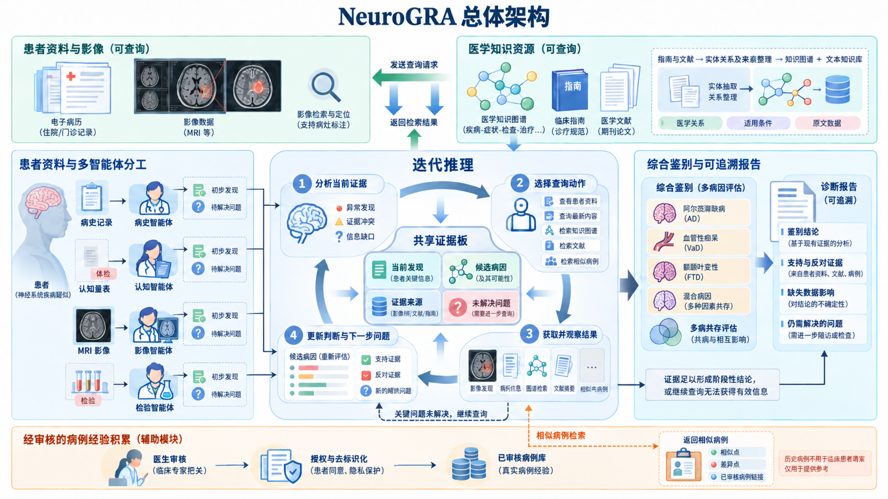

# NeuroGRA 系统总体设计方案

**基于图谱增强 RAG 与多智能体协作的神经退行性疾病辅助鉴别诊断系统**  
更新日期：2026 年 9 月 21 日  

## 第一部分 当前现状和背景

### 1.1 项目背景

NeuroGRA 面向认知障碍相关的神经退行性疾病辅助鉴别诊断。系统需要综合病史、认知评估、影像报告和检验资料，比较不同候选病因，并说明每项判断来自哪些患者发现、使用了什么医学依据，以及哪些信息仍不确定。

这一任务不能简单等同于给病例分配一个疾病标签。同一表现可能对应多个候选病因；同一患者也可能存在不同病因的共同贡献。病史、检查和量表来自不同时间及来源，实际可用资料不一定完整。因此，系统既要整合已知信息，也要保留未知、差异和不能完成的判断。

本项目的基本思路是：由不同智能体分析各类患者资料，以文本知识库和知识图谱提供共享医学知识，通过证据状态驱动查询与复核，最终形成可供医生核查的辅助鉴别报告。系统服务于医生的分析过程，首期研究集中于鉴别诊断及其依据组织。

### 1.2 相关研究基础

现有研究已为医学知识组织、疾病差异检索和多角色协作提供基础。以下工作用于说明可借鉴的方向，不将其在其他任务上的实验结果直接推广到本项目。

| 研究方向 | 代表性工作及已涉及的内容 | 对 NeuroGRA 的启示 |
|---|---|---|
| 医学图谱增强检索 | Medical Graph RAG 将用户文档与医学来源关联，并结合图检索组织回答依据 | 图结构适合连接概念和来源，但还需要核对知识在当前病例中的使用条件 |
| 面向疾病差异的检索 | Zhao 等人的 MedRAG 使用层次诊断图谱表达疾病差异，结合相似病历并提出后续问题 | 检索目标可以从“疾病相关内容”进一步明确为“当前鉴别需要的证据” |
| 混合证据与多专科协作 | MedCoRAG 面向肝病诊断研究混合证据检索与多专科共识 | 可借鉴知识检索与角色分工的结合，但需针对本项目的疾病范围重新设计和验证 |

以上概述分别依据 [Medical Graph RAG 正式论文页面](https://aclanthology.org/2025.acl-long.1381/)、[MedRAG 论文页面](https://arxiv.org/abs/2502.04413)和 [MedCoRAG 论文页面](https://arxiv.org/abs/2603.05129)。

因此，项目的研究价值应落实到具体机制：如何保留条款条件、如何选择有鉴别作用的证据、如何依据缺口选择下一步动作，以及如何使报告的判断强度与实际证据相符。知识图谱、RAG 和多智能体的组合本身不作为已经成立的创新或性能优势。

### 1.3 当前项目现状

当前仓库已整理总体方案、知识资料收集方案、离线知识构建方案、两项在线算法设计及架构图，具备进一步收敛任务和实现原型的文档基础。

截至本次梳理，`code/` 和 `data/` 目录仅有占位文件，尚未提供可运行的诊断主流程、正式知识库或病例评价数据。已有图示和文档描述的是拟建设能力，不能据此认定系统已经完成原始影像识别、多轮诊断推理或临床效果验证。

后续工作应围绕同一组数据对象和接口推进：先建立可核验的知识与患者事实，再完成检索、复核和报告生成。数据库产品、模型服务和智能体框架可在原型实现时选择，总体设计不以某个特定框架为前提。

### 1.4 首期范围与扩展边界

首期知识范围包括阿尔茨海默病（AD）、额颞叶变性（FTLD）相关病因、路易体相关病因，并将血管性贡献纳入鉴别与共同贡献分析。血管性因素单独表达，不归入神经退行性疾病类别。范围外线索应保留并提示进一步评估，不能为了输出固定类别而强行归类。

首期以病史文本、结构化认知量表、检验记录、影像报告及经过验证的工具结果为输入。原始 MRI 的定位、测量或特征提取通过后续工具接口扩展，其能力须单独验证。治疗方案生成、全病种覆盖和模型持续训练不纳入首期交付。

输出按三个层次组织：认知状态、临床综合征或主导表现、候选病因及可能贡献。不同层次分别记录；不能把认知状态、临床表型和病理病因混为一组互斥标签。

## 第二部分 要解决的问题

### 2.1 多源资料如何形成一致、可追溯的患者事实

病史、量表、影像与检验具有不同的表达方式和解释条件。直接把所有资料拼接给模型，容易丢失时间、单位、检查方法、否定范围和原始出处，也难以解释不同记录之间的差异。

系统需要先建立统一患者事实层，再进行知识解释。每项发现保留原值、标准化值、时间、来源和状态。尤其要区分明确存在、明确否认或阴性、未记录、未检查、不确定和记录冲突。缺失信息不通过模型推测补写。

### 2.2 如何检索真正有助于鉴别的医学证据

检索到与疾病名称相关的文本，只能说明主题相关，不能保证它能回答当前病例的鉴别问题。一般背景材料可能占据大量上下文，而关键比较条款、适用条件和限制信息未被保留。

系统需要围绕候选病因、患者发现和当前未决问题组织检索。检索结果应包含完整主张、前提、例外和出处，并在有限上下文内覆盖尽可能多的重要鉴别需求。这对应关键算法一：**条件感知的鉴别证据检索与集合选择**。

### 2.3 如何区分“知识没找到”和“患者资料不知道”

找到一条知识后，仍可能无法使用：知识本身缺少必要上下文，或者患者资料未提供条款要求的信息。这两种情况需要不同处理。前者可以检索原文和相关条款，后者只能核对已有患者记录；没有真实记录时，应保留未知并说明影响。

类似地，证据冲突、引用不支持、版本失效和判断层级不匹配，也不能统一交给一次笼统的“重新思考”。系统需要明确问题类型、允许动作、解决判据和受影响结论。这对应关键算法二：**证据状态引导的有界迭代复核**。

### 2.4 如何比较多个候选，并合理表达共同贡献

系统应分别组织各候选的支持依据、削弱因素、适用限制及未决问题，避免初始倾向决定后续只查有利证据。

“现有资料不能区分 A 与 B”和“分别有证据支持 A 与 B 共同贡献”是不同结果。前者属于鉴别未决，后者需要针对不同病因的患者依据与适用知识。多个候选尚未排除，不足以得出混合病因结论；不同智能体意见一致，也不构成独立医学证据。

### 2.5 如何生成可以核查、不过度推断的报告

报告应同时回答两个问题：当前患者实际有什么发现，这些发现依据何种知识支持当前判断。系统需要建立“结论—患者记录”和“结论—医学条款”两条追溯链，而不仅列出若干参考文献。

报告还应指出缺少哪项资料、限制哪项判断、已有信息仍能说明什么。不能因为存在局部缺失就放弃全部分析，也不能为了给出完整答案而隐藏重要限制。

### 2.6 设计目标与验证要求

| 目标 | 预期系统行为 | 验证重点 |
|---|---|---|
| 忠实表达患者资料 | 保留事实、时间、来源和缺失状态 | 事实抽取正确性、关键遗漏、缺失误补 |
| 获取有效鉴别依据 | 返回条件完整、用途正确的证据集合 | 同预算下的需求覆盖、条件误用、来源可定位性 |
| 选择合适复核动作 | 不同缺口对应不同查询或资料核对动作 | 动作正确性、实际解决率、成本和停止行为 |
| 控制结论强度 | 每项判断有依据，未决条件不被写成已满足 | 引用支持率、错误强结论、有效回答覆盖 |
| 支持多病因分析 | 分别比较候选，区分未决与共同贡献 | 与真实标签范围相符的鉴别表现和专业评阅 |

这些是待验证的目标。评价需同时报告错误与有效回答覆盖，避免通过少作判断获得表面上的低错误率。

## 第三部分 架构设计

### 3.1 总体架构图



**图 1 NeuroGRA 总体架构。** 上方为可查询的患者资料与医学知识资源；左侧为按资料类型划分的分析智能体；中间围绕共享证据板执行分析、查询、观察和更新；右侧完成综合鉴别与报告；底部为经审核的病例经验积累。

图中展示的是总体能力和扩展方向，具体实现遵循以下边界：图中的 MRI 分析首期由影像报告及已验证工具结果承载；“查询最新内容”指查询受管理的知识来源或提交知识更新需求，不能把未经审核的网页直接作为有效诊断规则；图中的 AD、FTD 和血管性痴呆等为示意，实际范围采用第一部分的定义，并包含路易体相关病因。图中的候选条形表示比较状态，不解释为经过校准的患病概率。

### 3.2 数据与知识层

系统区分四类资源，分别管理来源、权限和版本，并在分析时按需关联。

| 资源 | 保存内容 | 主要用途 |
|---|---|---|
| 当前患者资料 | 原始病历、量表、检查报告、影像及工具结果 | 回答当前患者实际观察到了什么 |
| 医学文本知识库 | 指南、共识、研究原文与完整条款上下文 | 语义检索、精确术语检索和原文核验 |
| 条件化医学知识图谱 | 实体、条款、适用条件、例外、鉴别关系及来源连接 | 关系扩展、条件补齐和证据组织 |
| 已审核病例经验库 | 经授权与去标识化的历史病例、医生修正及确认状态 | 提供相似病例和差异参考，作为扩展模块 |

文本知识库与知识图谱表达同一批受管理的医学知识，以条款 ID 和原文片段 ID 对齐。患者个体记录与历史病例不混入通用医学事实图谱，避免把某个患者的现象泛化为一般规则。

知识发布时同时冻结文本索引、图谱、来源版本和模型配置。一次病例分析绑定一个知识版本；分析期间发现更新需求，可登记后进入离线更新流程，避免同一次推理混用不同标准。

### 3.3 多智能体分析层

智能体按数据解释任务分工，共享患者事实与知识服务。分工用于减少资料处理混杂，并不要求各角色独立作出完整诊断。

| 角色 | 主要职责 | 提交结果 |
|---|---|---|
| 病史智能体 | 提取起病、病程、既往史、功能变化及相关叙述 | 带时间和出处的发现、待核对项 |
| 认知智能体 | 整理量表与认知领域表现，核对量表版本及解释条件 | 认知表现、解释限制、所需知识 |
| 影像智能体 | 分析影像报告或工具发现，保留检查方法和部位 | 影像事实、工具来源及局限 |
| 检验智能体 | 整理结果、单位、参考范围、检测方法和采样时间 | 检验事实、适用条件缺口 |
| 综合分析与流程控制 | 比较候选、生成需求、调用检索与复核、检查结论 | 更新后的证据状态和结构化结论 |

没有对应数据时，系统登记该类资料缺失，并跳过不具备输入的分析任务。角色之间出现分歧时回到患者记录、条款条件和判断层级核对，不能通过多数投票决定医学事实。

### 3.4 共享证据板

共享证据板是本次病例分析的统一状态载体，记录事实、候选、知识、缺口和结论之间的联系。它不等同于智能体聊天记录，也不要求保存模型内部思维过程。

| 对象 | 关键内容 |
|---|---|
| `Observation` 患者观测 | 事实 ID、字段、原值、单位、时间、方法、极性、缺失或冲突状态、原始位置 |
| `Hypothesis` 候选病因 | 候选 ID、所属层级、支持与限制依据、待解决问题 |
| `Need` 证据需求 | 目标候选或候选对、问题类型、已知和未知条件、重要性 |
| `EvidenceBundle` 证据包 | 完整条款、必要上下文、来源、适用状态、允许用途、覆盖需求 |
| `ReviewRequest` 复核请求 | 触发原因、允许动作、目标、成功判据、预算、执行结果 |
| `Claim` 结论 | 表述、判断层级、患者依据、知识依据、未决项、允许强度 |

每次更新保留事件记录，说明新增或修改了什么、来自何处、影响哪些结论。后续真实记录可以补充先前未知项，但不得无痕覆盖冲突或删除旧判断的依据。

### 3.5 查询与迭代控制层

控制器根据共享证据板选择动作：读取已有患者资料、查询知识图谱、检索原文、核对来源，或在扩展阶段检索相似病例。所有动作经统一工具接口返回带出处的结果，失败、无结果和超时也进入状态记录。

整体流程为：

1. **接入资料。** 确定患者、评估时点和可访问范围，整理原始记录。
2. **提取初步发现。** 各智能体提交事实和待核对项，不把初步解释写成已确认病因。
3. **形成候选与需求。** 在既定范围内组织候选比较，登记支持、限制、适用条件及共同贡献需求。
4. **检索医学证据。** 算法一联合文本与图检索，输出完整证据包及未覆盖需求。
5. **检查证据状态。** 算法二核对事实、适用性、冲突、引用和结论强度，生成具体动作。
6. **获取结果并更新。** 读取真实记录或重新检索，重新选择证据集合，更新受影响结论。
7. **停止并生成报告。** 达到停止条件后，输出有依据的判断和仍未解决的问题。

迭代次数、工具调用数、累计 token、总时延和最终证据上下文分别设置上限，所有角色共同遵守。达到预算、没有可执行动作、没有新增有效证据，或关键需求已完成时停止。证据仍不足时也可以终止，但必须保留相应结论限制。

首期实验可设置为“初次检索＋至多一次复核批次”，便于控制成本和比较方法；总体架构保留可配置的多轮能力。增加轮数必须有新的可执行问题和预算支持，不能把循环次数当作可靠性依据。

### 3.6 综合鉴别与报告层

综合模块先生成结构化结论对象，再由报告模块组织文字。报告包含：

- **病例概况：** 主要发现、评估时点及可用资料。
- **分层判断：** 认知状态、临床综合征或主导表现、候选病因及可能贡献。
- **鉴别分析：** 各候选的支持、削弱因素、适用限制及相互关系。
- **依据追溯：** 结论对应的患者记录位置和医学原文位置。
- **资料缺口与冲突：** 缺少或不一致的内容，以及对具体判断的影响。
- **后续评估方向：** 哪些补充信息有助于回答尚未解决的问题，供医生考虑。

报告不得将“倾向”润色为“确诊”，也不得将未找到支持表述为已有排除证据。证据链表示可核查的支持关系，不自动代表因果机制。

### 3.7 医生审核与病例经验积累

医生审核后，符合授权和去标识化要求的病例可进入经验库，保存审核后的结论、支持依据、当时缺失信息及确认程度。医生认可、临床诊断和后续证据确认分别记录；随访改变判断时保留版本与修正关系。

检索历史病例时，同时展示相似点、重要差异和诊断确认状态。历史病例用于提示可核对的方向，不能把其检查结果复制为当前患者事实，也不能把相似度作为患病概率。病例积累属于外部知识更新，不等同于模型已经完成持续学习。

病例经验库作为第二阶段扩展，在基本流程可以独立运行后验证增量价值。测试患者及其重复记录、随访结果不得泄漏到经验检索库或待诊断输入中。

## 第四部分 关键算法的设计

### 4.1 算法之间的关系

关键算法由一项离线基础流程和两项在线方法组成。

| 算法 | 输入 | 输出 | 定位 |
|---|---|---|---|
| 算法零：条件化知识构建 | 医学原文、术语表、审核规则 | 对齐的文本知识库与条件化图谱 | 为在线算法提供可靠知识基础 |
| 算法一：鉴别证据检索与集合选择 | 患者事实、候选、证据需求、知识版本及预算 | 完整证据包、适用状态、未覆盖需求 | 解决检索内容及有限上下文中的选择问题 |
| 算法二：证据状态引导复核 | 当前事实、证据包、结论草案和执行预算 | 查询动作、更新状态、受约束结论 | 解决缺口处理及迭代停止问题 |

首期研究重点放在算法一和算法二的增量效果。知识表示、混合检索、三值逻辑和预算选择均有已有技术基础，本项目研究的是其面向该任务的具体组织与验证。

### 4.2 算法零：医学文本到条件化知识底座

#### 4.2.1 核心表示

以可独立核验的医学主张作为条款节点，将条件和出处附着于条款，而不是仅保存“疾病—表现”关联。

```text
条款 → 涉及的疾病、表现或检查
条款 → 支持、削弱或限制的对象
条款 → 适用条件与例外
条款 → 判断层级与允许强度
条款 → 原文片段 → 文档、位置和版本
```

条款至少保存 `clause_id`、规范化主张、证据方向、判断层级、条件表达式、例外、原文片段和审核状态。实体名称可以规范化，但规范化摘要不能替代引用原文。

条件保留 AND、OR、NOT、数值单位、检查方法和时间范围。无法可靠结构化的条件保留原文并标记待核对，不猜测阈值或逻辑关系。

#### 4.2.2 构建过程

1. **来源登记。** 保存文档类型、版本、来源位置、文件哈希和使用范围，区分医学依据与方法研究材料。
2. **结构恢复。** 解析章节、编号、表格、脚注及页码，扫描文本需核对关键数字和否定词。
3. **语义切分。** 按完整条款切分，必要时携带表头、前后文和上级条件，避免截断前提。
4. **结构抽取。** 提取实体、关系方向、判断层级、条件和例外，并逐项绑定原文。
5. **规范化与审核。** 对齐术语，核对逻辑、单位、否定范围和来源支持；关键可执行条款经人工审核后发布。
6. **双库发布。** 建立关键词与向量索引，以及条款图谱，以统一 ID 和知识版本对齐。

去重只合并含义和适用条件等价的主张，保留各自出处。不同人群或检查方法下的不同表述不能直接判为冲突；版本变更应保留替代关系。

离线质量检查重点包括原文定位、条件完整性、逻辑解析正确性和双库一致性。构建成功不等于医学规则自动正确，仍须用审核样本检验抽取质量。

### 4.3 算法一：条件感知的鉴别证据检索与集合选择

#### 4.3.1 建立检索需求

输入患者观测集合 `X`、候选集合 `H`、需求集合 `U`、知识图谱 `G`、文本索引 `I` 和证据预算 `B`。

需求围绕“要区分什么、需要核对什么”建立，可包括候选差异、支持依据、限制条款、检查适用条件、替代解释和共同贡献。首期在四个候选组内可保留六个无序候选对的检查入口，按实际问题分配检索预算；候选对不预设互斥，也不要求每对都有可用差异证据。

查询由候选、判断层级、已知发现和需求类型组成。未知字段明确作为待核实条件，不能改写为阴性。初始模型倾向可以影响查询顺序，但不能作为永久删除其他候选的依据。

#### 4.3.2 联合召回与证据包构造

文本侧使用关键词和向量召回，图侧从候选病因、已知表现或检查节点检索相关条款，并沿受限关系取得条件、例外和出处。文本适合发现原文，图适合组织关系和必要上下文；图路径命中本身不构成患者诊断。

召回结果统一为证据包：

```text
证据包 = 主张条款 + 必要条件与例外 + 原文依据 + 来源版本 + 允许用途
```

若一个鉴别需求必须比较两侧条款，则组成完整比较包。图中未记录某候选的特征，不视为该特征不存在，更不能据此构造排除规则。缺少必要上下文的证据包先补齐；无法补齐时标记不完整，不以删除条件的方式压缩入选。

#### 4.3.3 适用条件与证据用途

对于条款 `c` 的条件表达式 `φc`，按患者事实求值：

```text
A(c, X) = Eval(φc, X)，取值为 T、F 或 U。
T：条件满足；F：明确不满足；U：未知。
```

AND 中任一条件为 F 则为 F，全部 T 才为 T，其余为 U；OR 中任一 T 则为 T，全部 F 才为 F，其余为 U；NOT 交换 T/F，U 保持未知。冲突观测单独保留冲突标志，对涉及该观测的条件不擅自选边。

| 状态 | 可用方式 |
|---|---|
| T | 进一步核对患者事实和条款方向后，可作为结论依据 |
| U | 解释缺少什么条件，产生复核需求；不能当作条件已满足 |
| F | 解释条款不适用，限制或撤回误用；不能当作该候选已被排除 |

适用条件满足只说明条款可用于当前情境，不代表已经满足该条款的全部诊断主张。结论内容和强度仍需单独检查。

#### 4.3.4 预算内证据集合选择

选择目标是取得覆盖重要需求的完整证据集合，而不是只按单条相似度截取 Top-k。设 `S` 为选中证据包集合，可采用以下开发起点：

```text
F(S) = Σu wu · max(d∈S) Mdu + η · Σ(d∈S) rd − λ · Dup(S)
约束：Cost(S) ≤ B
```

其中，`wu` 为需求重要性；`Mdu` 表示证据包 `d` 是否按允许用途完整覆盖需求 `u`，首期取 0 或 1；`rd` 为相关性分数；`Dup(S)` 衡量同一主张及高度重叠内容的冗余；`Cost(S)` 为最终序列化后包含条件、出处和状态元数据的实际 token 数。空集合覆盖为零，权重在开发集确定并冻结。

采用单位新增 token 的边际收益逐步选包：每次选择可放入预算且增益为正的候选，加入后重新计算覆盖与重复，直到无可行增益或预算用尽。零新增成本内容合并映射，不进行除零评分。可与最佳单包比较以减轻局部选择问题，不宣称该实现具有未经证明的最优性保证。

条件未知的条款可以覆盖“该检查有什么适用条件”这一知识需求，但不能覆盖“患者已经满足条件”这一事实判断。高相关性不得抵消用途限制。检索分数用于选材料，不转换为疾病概率。

#### 4.3.5 输出与失败处理

算法返回选中的完整证据包、条件状态、允许用途、来源版本、已覆盖需求、未覆盖需求及实际成本。

知识未找到、图关系缺失、原文不完整或证据包超出预算分别记录。无结果时保留缺口，不通过模型自由生成医学条款补齐。复核获得新材料后，与旧候选合并去重并重新选择集合，最终上下文仍满足同一预算 `B`。

### 4.4 算法二：证据状态引导的有界迭代复核

#### 4.4.1 结论级证据状态

对每条候选结论维护支持依据、削弱或限制依据、知识缺口、患者资料缺口、冲突、引用或版本问题及未覆盖需求。这些状态是有来源的记录集合，不是未经校准的概率向量。

冲突检查先核对主体、字段、层级、时间、方法和单位。同一患者不同时间的结果可能反映变化；不同层级的信息可能兼容；两个病因分别有支持也不必然矛盾。可比性不清楚时保留待核对状态。

#### 4.4.2 从状态选择动作

| 问题类型 | 允许动作 | 成功判据 |
|---|---|---|
| 医学知识缺口 | 向算法一提交定向需求 | 取得回答该需求的完整、可定位条款 |
| 条件或例外不完整 | 读取同来源上下文或关联条款 | 条件语义及作用范围得到核实 |
| 患者字段未知 | 读取已有原始病历、报告或工具记录 | 真实患者记录提供了对应信息 |
| 可比证据冲突 | 核对原始记录、时间、方法及适用条件 | 有依据地解释差异；否则继续保留冲突 |
| 引用不支持结论 | 核对原文，必要时换依据、缩小或撤回表述 | 修改后断言与依据内容及强度一致 |
| 版本或层级不匹配 | 核对有效版本及判断层级 | 改用有效依据或修正结论层级 |

没有可读取资料的患者缺口直接转为待补信息，不消耗文献检索轮次。保留未决是合法终止结果，但不能计入问题已解决的数量。

每个请求至少记录触发对象、目标结论、缺口类型、允许动作、成功判据、预算和状态。同一来源或同一字段的请求可合并执行。优先处理影响关键结论的事实错误、条件误用和来源支持失败，其次处理冲突及重要鉴别缺口。

#### 4.4.3 有界执行与状态更新

```text
初始化患者事实、候选、需求和统一预算
调用算法一，形成首轮证据集合

循环，最多执行 Rmax 个复核批次：
    建立或更新结构化结论及其依赖
    检查事实、条款适用性、冲突、引用与判断层级
    生成请求，合并去重，并在剩余预算内排序
    若无可执行请求或预算耗尽：停止
    执行资料读取、知识检索或来源核验
    按真实返回更新事实和证据；必要时重新选择证据集合
    依据成功判据更新请求状态
    若关键需求已完成，或没有新增有效信息和可执行动作：停止

对全部结论执行最终检查
生成报告，明确保留未解决问题与停止原因
```

`Rmax` 为可配置上限，首期可取 1。达到上限必须退出，各智能体不能在内部另起循环绕过控制。重复返回相同文献或相同模型意见，不算新增证据。

已识别的重大冲突需保留双方出处和必要摘录；证据重选不能只留下有利一侧。预算不足以完整呈现时，保留冲突状态并限制相关结论。

#### 4.4.4 结论输出约束

最终检查依次确认：患者事实是否存在，引用是否可定位，版本是否有效，条款条件是否满足，推断层级与强度是否超出依据。

关键检查明确失败时，当前结论必须改写或撤回；关键前提未知时，保留条件性表达、候选未决或仅描述事实。全部检查通过，也只允许达到医学条款支持的强度。

一个抽象示例是：条款 K 要求检测方法 M，而患者报告只记录结果、未记录方法。此时知识已完整，缺少的是患者字段。算法应读取原报告：若找到符合要求的方法，再检查其余前提；若方法不符，撤回对 K 的误用；若仍未找到，继续保留未知。无论检索到多少介绍 M 的文献，都不能将患者的方法字段补写为 M。

### 4.5 两项算法如何验证

算法评价与病例诊断评价分开进行，先检验机制，再验证整体收益。

| 评价环节 | 主要对照 | 主要指标 |
|---|---|---|
| 知识构建 | 人工核验原文与抽取条款 | 条件完整率、逻辑正确率、来源定位率 |
| 检索与选择 | 同语料的混合文本检索；同候选池的 Top-k、MMR；同条款信息的平铺检索 | 预算内完整需求覆盖、条件误用率、候选召回和实际成本 |
| 状态复核 | 不复核、固定查询复核、一般缺口反馈 | 错误强结论、缺失误补、真实解决率、回答覆盖和累计成本 |
| 系统整合 | 同模型同知识下的单智能体与多智能体 | 信息遗漏、证据支持、报告质量及任务对应的诊断表现 |
| 病例经验扩展 | 同流程下启用或关闭病例检索 | 质量增量、错误类比和检索成本 |

证据覆盖由独立标注的需求判断，不能用算法自身的覆盖分数充当金标准。实验应控制知识版本、可访问资料、模型、最终上下文和累计调用预算，避免把额外资源收益解释为算法收益。

按患者划分病例，并隔离同一患者的重复记录和诊断时点之后的信息；检索评价还需控制开发与测试条款组的交叉。病例只有认知状态或有限病因标签时，只评价标签能够支持的任务，不宣称验证了全部多病因鉴别能力。开发阶段的抽象缺口场景可验证流程，不能替代真实病例评价。

实施顺序为：先完成小范围审核知识底座及患者事实表示，再独立验证算法一，随后接入算法二和报告模块，最后评价多智能体及病例经验的额外作用。预期交付为可复现的知识版本、两项算法原型、可追溯报告流程和相应实验记录；实际贡献以验证结果为准。

### 4.6 相关设计资料

以下既有文档用于追溯设计细节。本文统一总体流程和研究边界；旧文档中的示例分数、查询数和固定轮数须在实现与实验前重新确认。

- [医学文本到 RAG 知识库与条件化知识图谱构建](算法零_医学文本到RAG知识库与条件化知识图谱构建.md)
- [鉴别证据检索详细设计](算法一_鉴别证据检索详细设计.md)
- [证据状态引导复核详细设计](算法二_证据状态引导复核详细设计.md)
- [医学知识资料收集方案](神经退行性疾病RAG知识库与知识图谱资料收集方案.md)
