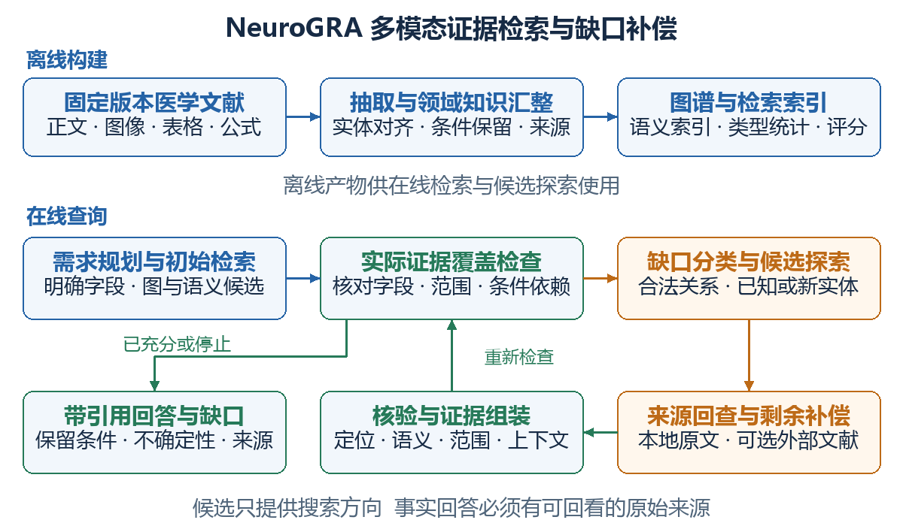
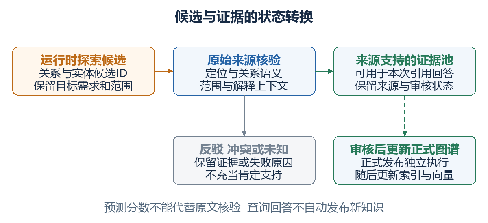
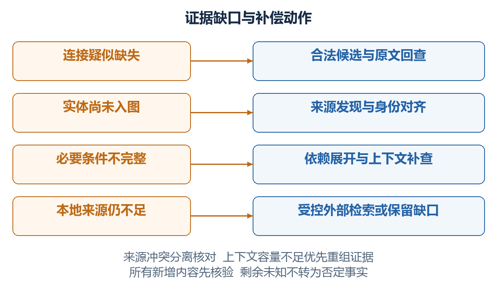

# NeuroGRA 多模态证据检索与缺口补偿算法设计

面向不完备医学知识图谱的需求驱动探索与来源约束

版本 v1.0　日期 2026年10月5日　研究状态 算法设计稿

本文为 NeuroGRA 定义一套统一算法，覆盖多模态文献建图、混合检索、证据缺口定位、关系与实体候选探索、来源核验，以及剩余缺口处理。方法面向神经退行性疾病相关的医学文献证据问答，沿用项目既有的知识与来源分层结构。文中的模块、公式和伪代码是拟实现设计，尚无实验结果；基础机制的研究来源以编号标注，并在配套研究来源记录中完整保存。

## 1 研究问题与方法目标

医学文献证据问答需要将问题中的概念、标准条目、时间限定、排除项和适用版本关联起来。有关信息可能分布于正文、表格、图注和脚注，形成跨片段或跨模态的多跳证据链。图谱能够显式组织这些连接，但实体遗漏、关系漏抽取和条件不完整会使已建图中的路径不足以支撑回答。

NeuroGRA 的核心思路是先明确回答所需的证据，再用图结构与语义检索获取初始内容；对未覆盖的需求，生成受类型和范围约束的探索候选，回到原文验证。无法通过本地资料解决的需求，按问题范围和预算进入外部文献检索，或明确报告未知。候选预测提供搜索方向，原始来源提供回答依据。

方法的目标是恢复遗漏的文献证据并组织完整的条件解释。本文不将未观测关系视为否定关系，也不通过图谱补全推断患者尚未提供的检查结果。真正的个体诊断决策属于另一项需单独定义和验证的任务。

本设计围绕三个可检验问题展开：需求定位是否提高必要证据覆盖；来源约束是否减少无依据连接进入回答；条件依赖展开是否减少时间、例外和框架范围的遗漏。后续实验应分别检验这些问题，不能将模块数量作为贡献证明。

## 2 总体算法

方法分为离线知识构建与在线证据检索。离线阶段解析多模态文献，建立带来源的领域知识图谱、辅助模态索引、类型关系统计和连接评分模型。在线阶段固定图谱发布版本与文档集合，执行需求规划、初始检索、缺口分类、定向补偿和证据组装。



图1 NeuroGRA 总体算法。上部为离线构建，下部为查询闭环。候选探索与来源核验之间保持明确边界；经核验的内容进入证据池，未解决的需求保留为缺口。联网属于可选补偿动作。

在线过程不要求每个问题都经过所有模块。证据已经充分时直接回答；没有合法图前沿时仍可检索原文；连接评分模型不可用时仍可执行类型与语义候选检索。外部补充不会突破问题指定的文献或标准版本范围。

## 3 知识表示与运行对象

### 3.1 正式图谱与辅助检索视图

正式图谱沿用既有17种核心节点类型和40种注册关系，保持知识内容层、来源主张层、文档与原文层。疾病、表现等由医学概念及其子类型表达；临床模式、时间约束、标准版本、条目绑定、组合规则和检测用途保留各自语义。图像、表格和公式的锚点属于辅助检索索引，候选连接、检索需求和查询记录属于运行对象。

固定发布版本的观测图定义为

\[
\mathcal G^{obs}=(\mathcal E,\mathcal R,\mathcal T^{obs}). \tag{1}
\]

其中，实体集合与关系集合分别为 \(\mathcal E\) 和 \(\mathcal R\)，观测三元组集合为 \(\mathcal T^{obs}\)。每条具有医学含义的直连边引用一条知识关系记录。导航三元组用于搜索，该记录保存适用范围、条件表达式、例外、极性、模态与来源，不得在检索时丢弃这些限定。

关系记录的语义表示为

\[
s=(h,r,t,\sigma,\kappa,\epsilon,\pi,\mu,\Lambda). \tag{2}
\]

这里，\(h,r,t\) 分别为头实体、谓词和尾实体，\(\sigma\) 为适用范围，\(\kappa\) 为条件表达式，\(\epsilon\) 为例外，\(\pi\) 为肯定或否定极性，\(\mu\) 为确定性或建议等模态，\(\Lambda\) 为来源引用。不同条件或版本的记录可以连接同一对实体，但不能直接合成为一条无条件事实。

### 3.2 证据与来源链

一个证据包包含原文片段、文档身份、页或区域定位，以及解释该片段所必需的表头、脚注、定义与限定。正式知识的追溯链为“知识关系记录 → 来源主张 → 原文片段 → 文档版本”。图描述和模态代理描述用于寻找原文，不能替代这条追溯链。

| 符号 | 运行含义 |
|---|---|
| \(q,\mathcal D,\mathcal I\) | 问题、固定版本文档集合、检索索引 |
| \(\mathcal N_q\) | 问题的证据需求集合 |
| \(\mathcal S_i,\mathcal P_i\) | 第i轮已核验的证据池、实际装入回答上下文的证据包 |
| \(\mathcal U_i\) | 第i轮未覆盖或存在未解决冲突的必要需求 |
| \(\mathcal H_i\) | 尚未作为事实确认的探索候选 |
| \(\mathcal F_i\) | 当前来源支持的探索前沿 |
| \(\mathcal B,\mathcal L_i\) | 检索和上下文预算、查询去重及审计记录 |

运行时的临时实体必须带来源和状态。未经审核的新知识不直接进入正式发布版本；查询可依据已核验的原文解释其内容，并明确其来源与审核状态。

## 4 离线多模态知识构建

### 4.1 内容解析与上下文保留

将文献分解为带定位的内容单元：

\[
c_j=(m_j,x_j,\ell_j,\mathcal C_j). \tag{3}
\]

模态 \(m_j\) 为正文、图像、表格或公式；\(x_j\) 为原始内容；\(\ell_j\) 为文档版本、页、字符区间或资产区域定位；\(\mathcal C_j\) 为标题、邻域正文、图注、表头、脚注等解释上下文。字符定位采用Unicode字符半开区间，资产定位至少保留可回看的页面与区域。

正文直接参与实体与关系抽取。非文本内容先生成可检索的语义描述，并与原始资产关联；描述中的定义、数值和条件需要回看原内容核验。表格抽取保留行列标题、单位和脚注指向，图像抽取保留图注与区域，公式抽取保留变量定义和适用说明。[1]

### 4.2 实体对齐与图谱汇整

文本抽取结果与模态描述抽取结果分别形成检索视图，通过稳定实体身份进行汇整。名称和别名只用于发现对齐候选，最终合并需要类型、定义和适用范围相容。同一条目在不同框架内的角色由条目绑定表达；同名但定义不同的对象保持独立。

关系抽取同时产生完整关系记录与导航投影。每项来源只支持其实际陈述的字段；仅提及名称的片段不能充当定义或关系依据。抽取后尚未核验的内容保持待审状态，正式图谱发布仅使用审核允许的记录。重复报道保留来源，但不重复计为独立结构连接。

### 4.3 语义索引与结构统计

分别建立实体描述、关系描述、正文片段和模态代理描述的语义索引，保留索引条目与原文的映射。实体层索引用于定位具体对象，关系与主题层索引用于获取关联和概括性内容；二者与片段检索共同提供初始候选。[1,2]

按实体类型和探索方向统计注册关系的观测频次：

\[
\psi(r\mid a,\delta)=\frac{F[a,r,\delta]}{\sum_{r'}F[a,r',\delta]}. \tag{4}
\]

\(a\) 为实体类型，\(\delta\) 为出边或入边方向，\(F\) 为当前观测图中的计数。统计按类型与框架兼容的视图计算，重复导航投影去重。分母为零时不产生先验概率，退回注册关系和问题所需关系。[3]

### 4.4 图连接评分模型

为已登记实体与注册关系学习复数向量，用有向连接评分提出结构候选：

\[
\phi(h,r,t)=\operatorname{Re}\left(\sum_{k=1}^{d}z_{h,k}z_{r,k}\overline{z_{t,k}}\right). \tag{5}
\]

其中，向量维度为 \(d\)，上划线表示复共轭，实部函数将结果映射为排序分数。该分数不解释为医学概率或事实正确率。[3,5]

训练仅使用当前允许发布的、范围相容的知识连接，不使用模态归属、来源挂载和文档包含等辅助边。正例必须保留原关系记录的语义；不同版本、条件和极性的命题不得无条件混入同一视图。负采样采用类型相容的候选，其中未观测连接属于训练对比项，不据此标记为事实上的否定。

可采用成对排序目标，令正连接集合为 \(\mathcal T^+\)，每个正连接的对比项为 \(\mathcal T^-(x)\)：

\[
\mathcal L=\sum_{x\in\mathcal T^+}\sum_{y\in\mathcal T^-(x)}\log(1+\exp(\phi(y)-\phi(x)))+\lambda\|Z\|_2^2. \tag{6}
\]

\(Z\) 汇集实体和关系向量，\(\lambda\) 为非负正则系数。维度、对比项数量和正则系数只在开发集确定。连接评分模型与图谱发布版本绑定；新发现且未进入模型的实体不参与闭集预测。稀疏图中该模型是否有实际增益，需要与类型和语义候选方法比较。

## 5 问题规划与初始检索

### 5.1 将问题分解为证据需求

问题规划输出主题实体、适用范围与证据需求。每项需求表示为

\[
n_j=(o_j,f_j,\sigma_j,\eta_j,w_j). \tag{7}
\]

\(o_j\) 为待解释对象，\(f_j\) 为所需字段或关系，\(\sigma_j\) 为范围与版本，\(\eta_j\) 为必要或可选标记，\(w_j\) 为检索优先权重。需求由问题意图、注册字段和已声明的规则依赖生成；模型输出受结构化字典约束，不能自行创造医学要求。

若问题未指定且无法合理确定框架版本，保留范围歧义，必要时请求澄清。检索可以先提供有版本标签的候选解释，但不能把不同版本拼成一套标准。本文中的权重只安排搜索优先级，全部必要需求仍需逐项检查。

### 5.2 结构与语义候选融合

结构通道从主题实体及关系主题出发，回取有限深度邻域和已有来源链；语义通道检索正文及非文本描述，允许发现尚未连入当前图路径的内容。对两路候选以倒数排名融合排序：

\[
\operatorname{RRF}(c)=\sum_{v\in\mathcal V_c}\frac{\alpha_v}{k_0+\operatorname{rank}_v(c)}. \tag{8}
\]

\(\mathcal V_c\) 为包含候选 \(c\) 的检索通道，\(\alpha_v\) 为通道权重，\(k_0\) 为平滑常数。缺席通道不贡献分数，去重依据文档版本与证据位置。这样避免直接相加不同尺度的语义相似度与结构分数。参数在开发集确定。倒数排名融合采用已有排序融合思想，本稿以通道权重作适配。[6]

排序只决定哪些原文优先读取。系统随后回取原始内容、核对来源和范围，并组成初始证据包；相关性高、图路径短或来源数量多都不直接等价于证据充分。

## 6 证据缺口定位

### 6.1 覆盖判定与需求状态

每项需求取以下状态之一：未检查、无支持、部分支持、充分支持、存在冲突或范围待定。只有实际上下文中的证据明确支持所需字段、必要解释上下文齐全且无未解决的范围或关键冲突，才判定为充分支持。

\[
\mathcal U_i=\{n\in\mathcal N_q^{req}:\operatorname{Cover}(\mathcal P_i,n)=0\}. \tag{9}
\]

这里 \(\operatorname{Cover}\) 是布尔覆盖函数，作用于实际装入回答上下文的证据包，而非检索候选数量。加权覆盖率仅用于分析和排序：

\[
\operatorname{Cov}_i=\frac{\sum_{n\in\mathcal N_q^{req}}w_n\operatorname{Cover}(\mathcal P_i,n)}{\sum_{n\in\mathcal N_q^{req}}w_n}. \tag{10}
\]

当问题没有必要需求时重新检查规划，不用空分母定义完整性。某一高权重需求被覆盖，不能抵消另一项必要条件的缺失。

### 6.2 缺口类别与处理动作

同一需求可以有多个缺口标记，系统按可执行动作处理，而不强行给它一个唯一病因。

| 缺口类别 | 可观察判据 | 首选动作 |
|---|---|---|
| 连接疑似缺失 | 端点已登记，所需导航边未观测或来源不足 | 类型与连接候选探索，随后回查原文 |
| 实体未入图 | 检索原文出现相关对象，但实体索引未解析出其身份 | 原文抽取、消歧与临时登记 |
| 条件不完整 | 已有核心主张，必要定义、时间、例外或依赖未覆盖 | 展开依赖并补查原文上下文 |
| 本地来源不足 | 去重后的本地动作仍未提供需求支持 | 范围允许时检索外部文献，否则保留缺口 |
| 来源冲突或范围歧义 | 同范围内容矛盾，或不同版本混在候选中 | 分离范围、检索冲突原文或请求澄清 |
| 上下文容量不足 | 证据池已有支持，实际回答上下文未装入必要包 | 重组或压缩证据包，容量不足时输出部分回答 |

“本地来源不足”是当前检索过程的结论，不能据此宣称全世界不存在该知识。图不连通也不证明原文缺失。缺口判定依赖抽取和核验模块，其错误率需要独立标注评价。

## 7 关系与实体候选探索

### 7.1 关系候选生成

对来源支持的前沿实体 \(e\)，合并现有邻接关系、同类型的高频关系和未满足需求明确要求的注册关系：

\[
\mathcal R_c(e)=\operatorname{Valid}_q(\mathcal R_{obs}(e)\cup\operatorname{TopK}\psi(\cdot\mid\tau(e),\delta)\cup\mathcal R_{need}(e)). \tag{11}
\]

\(\tau(e)\) 为实体类型。合法性检查包含关系注册、方向、端点类型和已知范围兼容性；已知范围冲突的候选剔除，范围未知的候选保留待核验标记。低频但属于必要依赖的关系优先保留，不能只靠频次剪枝。[3]

随后模型依据问题、当前缺口和已核验证据，在合法候选ID中选择探索方向。候选很多时分组筛选，每组可保留多个候选，再统一排序；候选较少时直接选择。模型输出只允许注册ID，不通过自由生成增加谓词。

### 7.2 已登记实体的候选生成

对选定谓词与方向，合并已观测邻居、语义候选及有嵌入的结构候选：

\[
\mathcal E_c(e,r)=\operatorname{Valid}_q(N_r^{obs}(e)\cup\mathcal E_{sem}(e,r)\cup\operatorname{TopK}_{t\in\mathcal E_{emb}}\phi(e,r,t)). \tag{12}
\]

方向为入边时使用 \(\phi(t,r,e)\)，不能简单反转事实含义。\(\mathcal E_{emb}\) 只包含已训练向量的实体。语义候选与结构候选分别排序，再采用式(8)融合；模型按ID筛选与未覆盖需求相关的候选，记录选择理由。选择理由仅是搜索日志。[3]

已观测邻居也可能缺少原文支持，因而仍需核验。没有嵌入或合法图前沿时，直接执行原文检索；该动作不依赖候选探索成功。

### 7.3 开放实体发现

对未入图对象，系统使用问题、未满足字段、已知实体别名和范围生成检索式。获得原文后抽取名称、类型、定义和关系陈述，先判断是否为已有实体的别名，再建立临时实体记录。

对齐不确定时保留多个身份候选，不强行合并。经过来源核验的临时记录可参与本次证据解释；正式登记、发布和向量更新走既有审核流程。当前查询中临时创建的实体不能冒充已训练的结构候选。

## 8 来源核验与候选状态转换

每个探索候选保存“端点、谓词、方向、范围、目标需求和来源检索式”。候选只引导搜索。核验函数同时检查定位、语义、范围和上下文：

\[
\operatorname{Verify}(h,p,q)=L(p)\land A(h,p)\land S(h,p,q)\land C(p). \tag{13}
\]

定位检查 \(L\) 核对文档版本、页与区域，文字引用要求原始片段在相应字符区间精确匹配。语义检查 \(A\) 核对关系方向、条件、否定与模态；“相关”“支持”和“导致”等不同谓词不得自动互换。范围检查 \(S\) 核对框架、版本、人群、测量方法等限定。上下文检查 \(C\) 确认表头、单位、脚注和必要定义已经回取。

前三项中的定位与字段一致性可部分确定性实现，关系语义和条件解释通常需要模型或人工判断。验证成功表示来源能够支持该陈述，不保证原来源本身正确，也不自动完成知识发布。来源明确反驳候选时，保存反驳证据与候选拒绝理由；来源含糊时维持未知。



图2 候选与证据的状态转换。预测得分不触发事实确认。定位与语义核对成功的内容进入本次证据池；反驳和无法判断分别保留。正式知识发布独立于查询回答。

下一轮图探索只使用已核验的实体和连接。未核验路径可以保留在日志中等待来源检索，但不能连续扩展成多跳事实链。反驳与冲突原文通过定位核验后作为相应状态的来源记录保留；它们不能充当被反驳需求的肯定支持。未知状态写入日志。回答需要解释冲突，不能用投票或高分候选静默消除差异。

## 9 条件依赖完整性

证据完整性不仅取决于找到核心关系，还取决于其解释所需的定义与限定。系统根据组合规则的表达式、已声明依赖和经核对的来源引用，展开必要对象。令初始对象集合为 \(K_0\)：

\[
K_{j+1}=K_j\cup\{v:\exists u\in K_j,\ v\in\operatorname{Dep}_q(u)\}. \tag{14}
\]

\(v\) 表示待加入的依赖对象。采用访问集合避免循环，到固定点或预算上限停止。依赖展开得到新需求后，重新计算缺口。未解析引用、不可执行的自由文本条件和尚未核实的范围明确标注为不完整。该闭包只覆盖已经声明或核验发现的依赖，不能证明源文献中所有条件均已成功抽取。

对于“解释一条完整规则”的问题，需要呈现规则中各分支的定义与限定；对于“解释某个指定分支”的问题，只展开该分支及共同前提。逻辑结构始终保留：ANY代表替代分支，NOT代表明确否定，未获取某对象的信息仍为未知。

以下仅为合成规则，不对应真实医学标准：

\[
R=A\land((B\land T)\lor D)\land\neg E. \tag{15}
\]

解释完整规则时，需要A、B、T、D、E及其来源和范围；这不表示B和D必须同时成立。若T的定义丢失，补查时间条件；若E没有原文支持，保留排除项解释缺口，而不能将其解释为“没有E”。本文只检索和解释规则，不代入患者数据作诊断判定。

## 10 剩余缺口的动作调度

### 10.1 选择可执行补偿动作

动作集合包含证据包重组、本地原文回查、图候选探索、外部文献检索和澄清。控制器先处理证据池已有支持但上下文未覆盖的需求，再处理明确的条件或原文定位问题；端点和注册关系可解析时启用图候选探索。本地搜索不依赖图前沿是否存在。

同一动作失败不立即宣告无进展。只有针对当前缺口的其他合法、未尝试且预算允许的动作也已耗尽，才触发无进展停止。每轮按“必要性优先、已知依赖优先、历史重复请求排除、估计成本较低优先”排序；相同优先级使用确定的ID顺序，便于复现。



图3 缺口驱动的动作分配。连接探索、开放实体发现与条件补查最终都返回来源核验。证据不足时，外部检索必须满足范围与预算条件；无法补足的需求进入显式缺口输出。

### 10.2 受控外部文献检索

仅当本地动作未能覆盖必要需求、问题允许外部来源且预算仍可用时，启用外部检索：

\[
\operatorname{Web}(n)=\operatorname{LocalTried}(n)\land\neg\operatorname{Covered}(n)\land\operatorname{Allowed}(q)\land\operatorname{BudgetOK}. \tag{16}
\]

LocalTried表示预定义的、去重后的本地检索动作已执行，不表示穷尽一切可能文献。Allowed表示允许引用外部文献；若问题限定某篇论文或某版指南，则搜索仅用于获取该来源及其正式勘误，其他版本单独比较。[4]

联网检索式包含目标实体、关系或缺失字段，以及版本和适用范围。优先获取原始论文、标准或指南原始发布来源，搜索摘要仅用于发现文献。外部资料解析后保存文档标识、内容校验、获取时间和原文位置，执行与本地相同的核验和条件展开流程。

当外部来源只提供间接推断、发生冲突或全文无法核实，保留相应状态。找不到支持时输出缺口，不能以模型记忆或连接得分填入结论。外部新知识经过审核后再更新正式图谱；回答过程不直接修改当前固定发布版本。

## 11 证据组装与停止条件

### 11.1 按必要需求组装回答上下文

证据包按需求组织，核心主张与解释它所必需的上下文作为一个组装单元。优先覆盖必要需求，合并重复原文，对长段落采用保留原始定位的摘录。结构化摘要只组织字段，其引用仍能回到原文。不得通过删去脚注、例外或否定词让证据包适配预算。

\[
\mathcal P_i\subseteq\mathcal S_i,\qquad\sum_{p\in\mathcal P_i}\operatorname{Tokens}(p)\le B_{ctx}. \tag{17}
\]

Token计算使用实际模型编码器并计入必要元数据和引用格式。图谱种子、预测路径和运行日志可以提供控制信息，但不得混入式(17)所指的事实证据。组装后重新执行式(9)和依赖检查；证据池中已覆盖而上下文未覆盖的需求转为容量缺口。

### 11.2 停止与回答类型

\[
\operatorname{Stop}_i=(\mathcal U_i=\varnothing\land\operatorname{Closed}_i)\lor\operatorname{BudgetReached}_i\lor\operatorname{NoAction}_i. \tag{18}
\]

Closed表示已声明的必要依赖在实际证据包中完成解释；NoAction表示没有合法、未重复且可执行的补偿动作。总搜索预算包括最大轮数、检索调用、模型调用或token、结构候选及外部请求；初始检索同样计入预算。上下文容量通过式(17)独立约束，容量不足先尝试重组，不能仅因装满上下文就提前跳过补偿动作。

必要需求全部覆盖时输出完整证据回答；部分覆盖时解释有支持的内容，并列出缺口及其影响；关键依据没有来源时保留判断。来源冲突的回答分别引用各方并标明冲突。每条事实性回答主张关联原文证据，最终再检查回答有无超出来源范围的内容。

已核验的证据池在固定查询中可以累积，但实际上下文覆盖率不保证每轮单调上升，因为新增依赖与容量重组可能暴露新的缺口。系统依据剩余合法动作和预算终止，不能假设“轮数越多必然完整”。

## 12 完整算法伪代码

### 12.1 离线构建

```text
算法1  多模态知识图谱与索引构建
输入  文档集合D  领域结构Schema  发布与审核规则Policy
输出  观测图G  原文索引I  类型统计F  连接评分器φ

01  为文档建立固定版本和内容校验记录
02  C ← 解析正文与模态内容并保存定位和解释上下文
03  X ← 抽取实体关系条件版本极性与来源
04  X ← 按类型定义范围和稳定身份进行实体对齐
05  为关系生成知识记录导航投影与来源主张
06  经审核的记录按Schema与Policy进入发布图G
07  I ← 建立描述语义索引原文索引与资产映射
08  F ← 在当前观测图中按类型方向和范围统计关系
09  φ ← 在范围相容的知识导航投影上训练连接评分
10  绑定G I F φ的版本并输出
```

第07行可保留可检索但尚未正式入图的原文内容。这是开放实体发现的基础。语义索引与连接评分器分别承担来源相关性搜索和已知实体连接排序，不混用为事实置信度。

### 12.2 在线检索与缺口补偿

```text
算法2  需求驱动的证据检索与缺口补偿
输入  问题q  固定观测图G  索引I  统计F  评分器φ  预算B
输出  带引用回答A  实际证据包P  剩余缺口U  审计日志L

01  N scope seeds ← 规划证据需求并记录范围歧义
02  S H L ← 空集  C ← 结构与语义初始检索
03  S ← 回取原文并核验C  所有调用记入B与L
04  重复直到停止条件满足
05      N ← 展开已声明及新核验发现的必要依赖
06      P ← 在上下文预算内组装S的必要证据
07      U ← 在实际P上检查必要需求与条件完整性
08      若U为空且依赖完整  则退出循环
09      若总预算已达上限  则退出循环
10      Jobs ← 按缺口类别生成未重复的合法动作
11      若Jobs为空  则退出循环
12      job ← 按必要性依赖和成本优先级选择动作  C ← 空集
13      若job为重组  则调整证据包优先级并登记尝试
14      若job为本地回查  则C ← 检索原文和必要上下文
15      若job为图探索
16          选择来源支持的前沿及注册关系候选
17          合并观测邻居语义候选和已嵌入结构候选
18          Hnew ← 在合法ID内选择探索候选
19          H ← H ∪ Hnew  C ← 根据Hnew回查原文
20      若job为外部检索且触发条件满足
21          C ← 检索并解析范围相容的原始文献
22      若job为澄清  则记录未确定范围并保留缺口
23      对回取C执行定位语义范围与上下文核验
24      从C发现未入图实体并消歧  核验其定义与关系
25      支持反驳及冲突来源写入S  未知与全部动作写入L
26      更新来源支持的前沿  记账并去重请求
27  N ← 再次展开必要依赖  P ← 组装实际证据
28  U ← 再次检查P  A ← 生成带引用回答及缺口解释
29  核对A的事实主张范围条件和引用  标明未解决项
30  新知识进入待审队列  返回A P U L
```

第13行的重组不生成新的C；每次新动作开始将C清空，避免复用上次结果。第22行如果关键范围需要用户回答，暂停依赖该范围的动作，仍可输出范围已明确的有来源内容。模型评分或核验操作的失败记录为未知或错误，不解释为事实阴性。

请求去重键至少包括需求ID、动作类型、实体与关系ID、检索式、文档或索引版本、范围以及上下文优先级签名。同一原文可以支持多个需求，但相同请求不能无限重试。已有结果被去重缓存命中时直接复用其来源记录，不再次计作新证据。

## 13 合成示例与分支行为

问题为“框架F中，模式P的时间限定是什么，适用于哪些条件”。源文献正文定义P，表格给出时间定义T，脚注给出适用条件C。以下全部为算法示例符号，不对应实际疾病标准。

| 观测情况 | 处理过程 | 输出行为 |
|---|---|---|
| P和T已入图，P到T的边遗漏 | 生成合法关系与T候选，检索原表并核验 | 解释原文支持的连接，保留来源 |
| T尚未登记，原表可检索 | 搜索时间字段，抽取并对齐T | 使用来源支持的临时记录，不调用T的不存在向量 |
| 已找到T，脚注C未取回 | 定位表格脚注并展开适用条件 | 补足限定后回答，未取回时标注条件缺口 |
| 本地缺少相关文献 | 满足条件时搜索外部原始来源 | 核验范围后引用；否则报告来源不足 |
| 检索到另一版本F2 | 分离F与F2的主张和来源 | 不把F2的限定补成F的定义 |
| 证据池齐全但上下文预算不足 | 组装必要定义与条件，减少重复解释 | 无法完整装入时给出部分回答及容量缺口 |

该例表明，恢复连接、发现实体和获取条件是不同动作。一次候选预测不能同时完成这些任务，最终依据仍是可定位的原文。

## 14 计算开销与可检验性质

设选中的关系方向数为M，已有嵌入实体数为N，向量维度为d。直接遍历实体的结构候选评分开销为O(MNd)，可通过类型分区、分批计算或近似候选索引降低实际搜索量。观测邻域遍历受深度和边数预算约束；语义检索开销取决于具体索引，不能笼统声称为常数。

依赖闭包在有限节点和引用集合上使用访问集合，开销为O(|Vdep|+|Edep|)。端到端开销还包括原文读取、模型筛选、语义核验、外部请求和实际回答长度。训练开销、在线开销及缓存命中分别报告。

在每轮执行至少一个新动作且轮数、调用和候选预算有限时，算法能够终止。无来源候选不直接进入事实回答，是由状态与接口约束建立的设计性质；其实现是否正确仍需测试。完整性只针对已规划并展开的需求，不能证明问题规划和文献抽取没有遗漏。

## 15 实验设计与贡献边界

本设计拟检验三个机制：需求驱动的探索、候选与证据的来源约束、条件依赖及剩余缺口调度。多模态解析、混合检索、类型统计和连接评分属于基础机制，正式论文应配套引用。本文提出的组织方式是否优于已有方法，需要实验而非更名来说明。

建议设置单轮混合检索、多轮直接原文检索、类型与语义候选探索、加入连接评分的探索，以及完整来源约束与条件展开等对照。消融分别移除需求定位、连接评分、来源核验和条件展开。对照使用相同文档、模型和总预算，特别比较“额外直接搜原文”是否已能获得同等收益。

缺失场景分为删关系、实体未入图、条件抽取遗漏和本地原文不足。每个删减图重新构建类型统计、连接模型、导航缓存和派生描述，防止完整图泄漏；保留原文是有意的恢复通道。缺实体时同时移除实体候选和身份向量，不能只删除显示节点。

外部补充单独设置“关闭外部检索”“直接外部补充”“按缺口触发并核验”三个条件。保存同一批外部来源快照、查询和获取时间，联网组使用一致可访问资料与请求预算，区分方法增益和资料增量。[4]

评价使用独立人工标注的必要字段、正确关系与来源。报告字段覆盖、关系恢复精确率与召回率、引用支持正确率、条件及版本错误、无依据主张、冲突处理和拒答行为，并记录调用、token和耗时。不能用系统自己的核验结果充当唯一正确答案。数据按文档或框架版本合理划分，参数仅在开发集选择。

## 16 实现接口与待验证事项

| 模块接口 | 输入 | 输出 |
|---|---|---|
| 内容解析与知识汇整 | 文档版本与领域契约 | 定位内容单元、知识记录、审核队列 |
| 证据需求规划 | 问题与注册字段 | 需求、范围、种子实体、歧义 |
| 混合检索 | 问题、需求、固定索引 | 排名候选及原文映射 |
| 缺口检测与依赖展开 | 实际证据包、需求、规则 | 缺口标记及新增必要需求 |
| 候选探索 | 来源支持前沿、需求、统计与模型 | 合法候选及来源检索式 |
| 来源核验与实体发现 | 原文、候选、范围 | 支持、反驳、冲突、未知和临时实体 |
| 动作调度与证据组装 | 缺口、证据池、日志、预算 | 下一动作、实际上下文、停止原因 |
| 引用回答与发布队列 | 实际证据包及剩余需求 | 回答、引用、缺口说明、待审记录 |

最低可运行版本先实现稳定定位、需求结构、混合检索、直接原文回查、来源核验和缺口输出。随后加入候选统计与结构评分，对照验证其独立价值；再加入外部检索与发布更新。各模块应输出结构化对象，控制器不能只在已经生成的回答后追加提示词。

待验证事项包括需求规划是否漏项、条件抽取和同名对齐是否可靠、稀疏图中结构候选是否有效、语义核验是否会误接受、外部来源是否造成版本混用，以及必要上下文是否超出容量。所有“提高”“减少”类性能结论均待实验后填写。

## 17 可用于论文方法章节的总述

本文设计NeuroGRA，一种面向不完备医学知识图谱的多模态证据检索与缺口补偿方法。离线阶段，方法将正文、图像、表格和公式解析为带来源定位的内容单元，通过实体对齐与限定保留构建知识图谱，并建立语义索引、类型关系统计和连接评分模型。在线阶段，方法将问题转化为必要证据需求，结合图结构与语义检索获取初始来源，依据实际回答上下文定位未覆盖需求。针对连接疑似缺失，方法生成受类型、方向和范围约束的关系与实体候选，并以候选引导原文检索；针对实体未入图，方法从来源中发现、消歧并临时登记对象。候选经定位、关系语义、适用范围与解释上下文核验后进入证据池。方法进一步展开必要条件依赖，并对剩余缺口执行本地补查、受控外部检索或显式未知输出。最终根据证据覆盖与预算生成带引用、带适用限定和缺口说明的回答。

