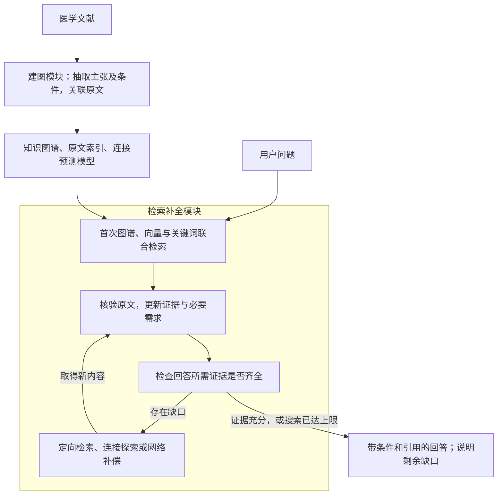

# NeuroGRA：条件化知识图谱构建与迭代检索补全

版本：v1.1，重写稿　日期：2026-10-08　状态：待实现与验证的算法设计。

## 1 先看这套算法要完成什么

用户提出一个医学文献问题后，系统应找到回答所需的原文，并把原文中的条件、例外和版本一起解释清楚。困难在于：这些内容可能分散在正文、表格和脚注中，构建的图谱也可能漏掉部分实体或关系。因此，系统需要在第一次检索之后判断证据是否足够，再决定到哪里补找。

这套算法由两个模块组成。**建图模块把文献整理成带条件和出处的知识，同时保留完整原文的检索入口；检索补全模块从问题出发，反复寻找、核验和组织证据，直到足以回答或达到搜索上限。** 前者主要解决知识如何保存，后者主要解决缺失时如何继续寻找。



图 1 总体架构。图谱、向量检索、连接预测和网络搜索共同服务于这个循环；是否继续检索，由当前问题还缺哪些证据决定。

为便于理解，全文使用同一个合成例子：用户问“**某版标准中，一项影像检查在什么条件下可以作为支持依据？**”假设正文说明其支持用途，表格规定判定方法和时间要求，脚注说明某种干扰因素会限制结果的使用。这些只是算法示例，不对应真实医学标准。

读完整个方案，应当能够追踪这三个位置的信息如何被保存、如何被找到，以及脚注遗漏时系统怎样继续搜索。

## 2 建图模块：把主张和它的条件一起保存

### 2.1 为什么要保存完整的知识声明

在上面的例子中，只保存“影像检查—支持—诊断类别”这条边，会丢掉方法、时间和干扰因素。以后即使检索命中了这条边，回答仍可能扩大原文的适用范围。

因此，图谱的基本记录是一条带限定的声明：它表达什么关系，在什么范围内、什么条件下成立，有什么例外，以及这些内容分别来自哪里。主图仍然可以显示简洁的实体连接；读取关系详情时，再展开完整声明和来源。

例子中的知识可以整理为：

```text
主张：该检查结果可以作为指定类别的支持依据。
条件：采用文献规定的判定方法，并满足相应时间要求。
例外：文献声明的干扰因素会限制该结果的直接使用。
范围：该版标准；其他适用范围以原文实际规定为准。
出处：支持用途来自正文，方法和时间来自表格，例外来自脚注。
```

这里需要保留“并”“或”“排除”等逻辑。例如，两个条件同时需要满足，就保存为 ALL；替代条件保存为 ANY；明确否定保存为 NOT。原文仅表示“支持”时，保留这种语气。

数据结构继续沿用既有的 [图谱结构 v0.3](<D:/Python Project/NeuroGRA/docs/知识图谱设计/NeuroGRA_知识与来源分层图谱结构设计_v0.3.md>)。KnowledgeStatement 保存关系声明及其限定，CriterionBinding 保存条目在特定框架中的角色，DiagnosticRule 保存组合规则。原有 17 类节点和 40 种关系提供模式约束，本算法不另建一套类型体系。

### 2.2 怎样从文献得到这样的记录

抽取从可定位的内容开始。正文保存段落位置；表格保存行列标题、单位和脚注标记；图像保留图注和必要区域；公式关联变量说明。保留这些结构，是为了让后续抽取能够识别某个限定究竟指向什么。

随后先识别对象，再围绕对象抽取声明。第一轮找出检查、结果模式、标准条目、版本等对象，以及它们在原文中的边界。第二轮识别对象之间的关系，并读取与关系相关的方法、时间、例外、否定和语气。

**这部分的核心是条件归属。** 假如一张表中列出了多项检查，某个脚注只标在其中一行，系统必须把脚注绑定到那一行对应的声明。绑定依据首先是脚注标记、表格行列和条目引用，其次是语义指向、对象类型和版本范围。程序核对显式结构，模型在合法对象与声明中判断语义归属。

在贯穿例子中，表格里的方法和时间应共同限定正文所述的检查用途，脚注中的干扰因素也应挂到同一用途记录。若归属存在歧义，就保留原文和待确认关系，继续核对上下文。尚未可靠解析的条件可以保存为文本，但不能直接当作可执行规则。

最后进行实体对齐。名称和语义相似度先提出候选，再依据定义、类型和范围确认身份。同一个名称在不同标准中定义不同，就分别保存；同一条目在不同框架中的角色由框架内绑定表达。

### 2.3 为什么图谱之外还需要原文索引

建图完成后，仍然保留所有允许检索的原文，包括尚未成功抽取进图谱的段落、表格和图注。原因很直接：如果某条关系漏抽取，恢复它的依据通常还在原文里。

因此，建图模块同时产生两个互补的资源。**知识图谱组织已经识别出的对象、关系和条件依赖；原文索引保留重新发现遗漏知识的机会。** 每条知识记录都能回到支持它的原文位置，图谱和原文之间可以双向查找。

向量索引也相应分成两部分。知识向量索引编码实体定义和完整声明，帮助问题找到图谱对象；原文向量索引编码段落及模态描述，帮助系统在图谱不连通时直接找到来源。关键词索引补充名称、缩写、版本和明确术语的查找。

在例子中，即使“检查用途—依赖—判定方法”这条边没有建出来，原文向量检索仍可能找到方法所在的表格。找到后核验，就能恢复遗漏的依赖。

### 2.4 怎样为后续连接补全做准备

原文检索可能仍未召回关键段落。为了增加探索入口，系统从已确认的图结构中学习“哪些类型的对象通常通过哪些关系连接”，并训练 ComplEx 连接预测模型。

这需要区分两种向量：文本嵌入用于比较表达的语义相关性；ComplEx 的实体与关系嵌入用于评价一个候选连接是否符合已学习的图结构。两者各有检索目的。

ComplEx 离线使用审核允许的连接训练。训练时按相容范围组织记录，去除重复连接，保留关系方向；类型相容的端点替换构成训练对比项。对比项用于学习排名，未观测连接仍不能据此认定为事实上的否定。条件或版本不同的记录分开组织，结构评分不承担全部条件逻辑的表达。

模型与发布图版本绑定。大语言模型和文本嵌入模型先采用预训练能力，ComplEx 的维度、采样和正则参数在开发集确定。查询中新发现的实体尚无结构向量时，使用原文和临时图检索。

到这里，建图模块交付的是：**带条件和来源的图谱、可直接搜索的原文、以及用于提出连接候选的模型。** 下面说明它们如何共同回答一个问题。

## 3 检索补全模块：围绕尚未解决的问题继续查找

### 3.1 第一次检索前，先明确要回答什么

系统先理解用户要解释的对象、关系和版本，再列出必要的信息。在例子中，回答至少需要说明检查的支持用途、结果如何判定，以及原文规定的限制。需求来自问题和领域字段；检索到明确的定义引用后，还可以增加必要依赖。

这些需求是后续判断是否继续搜索的依据。它们不要求一次规划就穷尽全部细节，但需要保留产生依据：某项内容是用户直接问到的，还是已找到的声明明确依赖的。

问题指定标准版本时，所有检索围绕该版本展开。版本歧义会影响结论时，先澄清关键范围；比较任务则分别保留各版本分支。

### 3.2 图谱和向量怎样共同完成检索

第一次检索同时使用图谱、向量和关键词通道。图谱从问题涉及的检查或条目出发，回取角色、规则及相关定义；向量检索从语义上召回相关声明和原文；关键词定位名称、标准年份和明确术语。

例如，用户说“能否作为支持依据”，文献可能使用另一种表达。向量检索有机会找到语义相关段落。找到对象后，图谱可以进一步指出它关联的判定方法、条件或脚注。图谱缺边时，原文检索仍继续工作。

不同通道的原始分数含义不同，结果先映射到知识记录及原文位置，再按排名融合。主方案采用 RRF：同一个候选在多个通道中排名靠前时，获得更高的读取优先级。排名只决定先看哪些内容。

读取时回到原文。表格单元格连同必要表头和脚注回取，定义引用按 ID 补读。向量相似并不自动意味着否定、阈值和适用条件一致，这些内容在核验时逐项比较。

后续检索使用同样的通道，但查询目标会改变：从“这项检查有什么用途”，收窄为“该用途依赖的判定方法是什么”或“脚注限制了哪种使用情况”。向量检索因此贯穿整个循环。

### 3.3 怎样判断当前回答还缺什么

假设第一轮找到了正文中的支持用途，却没有找到方法和脚注。系统此时可以确认原文确实讨论了该用途，但还不能给出完整的条件解释。

判断是否充分，需要把已核验内容与必要需求逐项对照。每项需求至少回答三个问题：原文是否明确支持所需内容；必要的定义和限定是否已取得；来源是否属于问题要求的范围。只找到核心关系时，记录为部分支持，并保留还缺哪些内容。

缺口的原因决定补找方式。文中已经给出了脚注或定义引用，就直接按引用补读。原文出现一个尚未入图的方法名称，就从原文识别和消歧该对象。端点已知但所需关系仍找不到时，才进入连接候选探索。本地相关动作仍不能找到依据时，再考虑外部来源。

因此，系统需要区分“图里没有”“本轮没检索到”和“本地缺少来源”。这种区分决定该修复结构、扩大原文检索，还是扩展语料。证据存在但未装入最终回答上下文的情况，则在证据组织环节处理。

### 3.4 关系缺失时，图谱补全怎样帮助检索

当两个对象已经登记，但用于回答的连接缺失时，系统先确定可能需要哪种关系。候选方向结合当前需求、已有邻接关系和类型—关系统计产生；与问题直接相关的必要关系保留，不能只按频率筛选。

接着合并三类对象候选：现有邻居、语义检索找到的对象，以及 ComplEx 提出的结构候选。先检查关系注册、端点类型、方向和已知范围，再结合问题及缺失字段选择值得追查的候选。模型在合法 ID 中筛选并记录理由。

ComplEx 对候选连接的评分为：

\[
\phi(h,r,t)=\operatorname{Re}\left(\sum_{k=1}^{d}z_{h,k}z_{r,k}\overline{z_{t,k}}\right).
\]

其中，h、r、t 分别是头实体、关系和尾实体，z 是离线学习的向量。分数越高，表示该连接越符合模型学习的结构模式，因此可以优先追查。它不表示医学正确概率；入边使用相应方向的评分。

被选中的候选会转成原文查询。例如，候选认为某检查用途可能依赖某方法，就检索两者共同出现、解释其依赖关系的原文。只有来源确认了关系及必要限定，才把它加入本次查询的已确认结构。

这里有两层结果：**模型先提出“值得查的连接”，原文再确认“可以使用的知识”。** 图谱补全的作用，是在普通检索尚未取得必要关系时提供新的查找方向。

如果缺的是整个实体，就从原文发现和对齐实体；如果缺的是已知关系的脚注，就直接补读脚注。结构模型用于它能够处理的连接缺失场景。

### 3.5 本地不足时，网络搜索怎样接入

在贯穿例子中，系统可能已经找到方法定义，却发现脚注解释位于本地未下载的附件。此时缺口已经具体到一个来源或字段，AI 可以据此生成网络检索式，寻找原始发布页面、同版本附件或正式勘误。

网络搜索针对某一项必要缺口触发。相关且可执行的本地路径已经尝试、问题允许引用外部来源、预算仍有余量时，就可以启用。没有合法图候选时也能在本地原文检索之后启用。

AI负责构造查询、筛选来源和抽取待核验内容。优先回取原始论文、指南或标准，搜索摘要只作为寻找原文的入口。指定版本的问题围绕该版本及正式勘误展开；其他版本需要分开解释。

找到的资料记录文档身份、地址、获取时间和原文位置，再进入与本地相同的核验流程。如果附件确实补足了脚注限制，证据可以用于本次回答；来源含糊或无法核实全文时，保留未解决状态。

### 3.6 为什么补全之后还要再检索

补回一个字段，可能同时发现新的依赖。例如，找到表格后才知道结果需要使用某个判定方法；找到方法定义后，才知道它还有适用范围。下一轮检索因此由新发现的必要依赖触发。

每轮结束时，系统更新两类内容。第一类是已核验的原文及其支持字段，形成可累积的证据池；第二类是本次查询中已确认的实体、关系和依赖，形成查询临时图。下一轮既可以搜索原文，也可以沿新确认的连接继续查找。

候选预测单独保存，尚未核验的路径不作为事实连续扩展。原图的发布版本保持固定；查询中确认的新知识带来源进入临时结构，正式发布另行审核。新实体暂时没有嵌入时，使用语义检索和临时图路径。

依赖展开只沿原文明确声明且与问题相关的定义和引用进行。解释完整规则时保留各分支；只问一个分支时保留该分支及共同前提。访问集合避免循环引用。这样能控制扩展范围，同时保留必要条件。

在贯穿例子中，循环可以表现为：

```text
第一轮：找到支持用途，发现判定方法和限制尚缺。
第二轮：找到表格与方法定义，发现还需要解释脚注。
第三轮：取得同版本附件，核验脚注中的干扰因素。
最终检查：用途、方法、时间和限制能否共同支撑回答。
```

初始检索如果已经充分，可以直接回答。新增依赖也可能让当前缺口增加，因此轮数越多不必然意味着更接近完成。

## 4 怎样把检索结果变成可靠的回答

### 4.1 先核验，再组织证据

每次回取原文后，先确认文档与位置有效，再判断原文支持什么关系、限定什么对象，以及版本和方法是否相容。表格或图像中的数值和条件回看原始内容。

位置、引用匹配和部分字段格式可由程序检查；语义支持与条件归属由模型辅助判断。结果区分支持、反驳和未确定，并记录已支持字段及尚缺上下文。验证器的误判需要独立评价。

找到核心声明却缺脚注时，保留部分证据和明确缺口，让下一轮继续补查。来源明确反驳候选时，保存反证并拒绝该候选。相同范围内存在关键冲突时保留双方依据，暂不把争议关系作为无争议事实继续扩展。

核验确认的是来源确实表达了该声明。它不自动保证来源本身正确；回答中的语气和范围仍随原文保留。

### 4.2 以完整解释为单位选择内容

检索结束后，回答模型需要同时看到核心声明及理解它所需的条件。例子中的支持用途、判定方法、时间要求和脚注限制，应组成一个完整证据包。

多个片段共同满足一个需求时，先组成充分组合，再选择是否装入上下文。否则，正文和脚注各自都不充分，按单片段价值选择可能把两者都漏掉。比较来源分歧时，也需要保留比较双方。

在上下文预算内，优先选择能增加完整需求覆盖的证据组合；覆盖相同时选择实际 token 成本较低的组合。共享定义和重复原文只序列化一次，必要时进行有限次替换。成本包含原文、条件、引用和组织文字，并为问题、生成与最终核验预留空间。这是一种启发式选择策略，效果通过实验衡量。

不同来源可以共同解释已有声明的不同字段或依赖，但需要核对定义和范围。跨来源推导的新综合命题另行标注，不能把不同版本的条件拼成一套标准。

**充分性最终检查实际交给回答模型的内容。** 即使搜索过程中已经找到脚注，若最后上下文没有包含它，相关需求仍然不完整。这种情况先尝试重组和保留原文定位的摘录，仍放不下时限制回答范围。

### 4.3 何时结束循环

结束搜索有三种原因：回答所需内容及已发现的必要依赖已经得到解释；搜索预算达到上限；当前没有合法、未尝试且可执行的动作。一次检索失败后，仍可以尝试其他路径。

系统分别约束轮数、检索调用、模型调用及 token、结构候选数量、网络请求和最终上下文长度。初始检索、依赖补读及来源核验都计入成本，并预留生成和最终核验预算。

最终回答说明结论、适用条件和版本，并为各项事实关联原文引用。有支持但不充分时，说明哪些内容已确认、哪些仍缺及其影响；存在冲突时分别呈现来源。生成后再核查是否遗漏了必要限定或超出原文范围。

“充分”针对本次问题和已经展开的相关需求。问题规划或文献抽取仍可能漏项，因此评价必须使用独立标注。

## 5 将上述逻辑落实为算法

前面的正文解释了各环节为何存在。实现时，整个在线循环可以压缩为下面的控制过程。建图、索引和 ComplEx 训练在查询前完成，查询只使用固定发布资源及本次临时结构。

```text
输入：问题，知识图谱，原文索引，连接预测模型，范围与预算
输出：带引用回答，实际证据，剩余缺口，停止原因

规划问题所需信息及适用范围
进行第一轮图谱、向量与关键词联合检索

重复执行：
    回取原文，核验支持字段、条件、范围和引用
    累积证据，更新本次查询中已确认的知识
    根据明确的来源依赖补充回答需求
    在上下文预算内组织完整证据包
    检查实际上下文还缺什么

    如果证据充分，或者预算／合法动作已经耗尽：结束搜索
    根据缺口选择下一动作：
        条件或定义缺失 → 定向补读原文及引用
        实体未登记 → 从来源发现、消歧并临时登记
        已知实体间连接缺失 → 结构候选引导原文检索
        本地来源不足 → 在允许范围内搜索网络原始来源
        已有证据未装入上下文 → 重组证据包
    记录尝试及成本，将新结果送回循环

根据实际证据和剩余缺口生成回答
检查事实、条件、范围及引用；说明不能确定的内容
将新知识送入待审队列
```

为使上述过程可复现，实现时保留以下约定：

- 条件与版本来源跟随每条知识声明。缺失字段保留未知；核对指定来源后确认未报告，才记录未报告，明确不适用则附理由。
- 必要依赖优先回取。一般邻居可以剪枝，不能仅因相似度低而丢弃明确必需的定义。
- 候选排序在通道内部完成，再以 RRF 融合。预测分数、文本相似度与事实支持分别记录。
- 动作先利用已有证据与明确引用，其余按必要性、依赖和估计成本排序。相同优先级使用固定顺序，参数在开发集确定。
- 请求按需求、动作、查询、目标对象、范围和资源版本去重。证据重组另记组合签名；缓存复用不算新证据。
- 范围需要澄清时暂停相关动作，其他已明确内容可继续。来源未报告某字段，可以回答“是否报告”的问题；要求该字段具体值时仍保留未知。
- 网络结果固定来源记录并执行同一核验流程。模块超时、调用失败和无结果均记录为运行或证据缺口。

## 6 研究重点与验证方式

### 6.1 两项研究内容怎样衔接

第一项研究是条件化知识构建，重点观察条件是否归属正确、完整声明是否保留。第二项研究是迭代检索补全，重点观察系统能否识别必要缺口，并在相同预算内更有效地取得充分证据。前者提供可供检索使用的条件结构，后者验证这种结构如何影响搜索与回答。

脑连接论文提供实体边界、关系方向和分阶段评价的参考；金融超关系论文提供类型和角色参与抽取、查询信息参与图上计算的参考。这里迁移的是设计思想：金融论文的多元关系并不自动表达医学布尔条件，其查询条件也不等于医学适用条件。

向量检索、RRF、ComplEx 及网络补偿采用已有方法。拟研究部分在于条件归属、需求与缺口建模，以及检索、核验和完整证据组织之间的反馈机制。是否形成有效贡献，需要相关工作核对和实验支持。

### 6.2 实验应回答哪些问题

构建实验比较扁平三元组、带属性结构和条件化结构，使用人工标注评价条件归属、完整声明、版本混淆及逐字段来源。

检索实验分开观察语义召回、结构补全和循环调度的作用。所有检索策略共享相同知识、原文、模型与预算，主要对照如下：

| 对照 | 要检验的问题 |
| --- | --- |
| 单轮关键词与向量检索 | 多轮机制相对基础召回增加了什么 |
| 同信息的需求驱动多轮文本检索，配合完整证据包 | 直接多搜原文是否已经足够 |
| 固定图扩展；简单依赖查询加完整包选择 | 自适应缺口调度是否优于直接邻居或依赖回取 |
| 完整方法移除 ComplEx | 结构预测是否提供独立收益 |
| 完整方法移除条件闭包或联合证据组织 | 条件结构和最终上下文选择是否发挥作用 |

进一步消融原文向量检索、类型约束和条件归属。网络实验单独比较关闭网络、直接外部补偿和按缺口触发补偿，使用一致的来源快照及请求预算，区分新增资料和调度算法带来的收益。

金标准由人工独立标注必要字段、正确关系、条件归属和支持原文，允许多套等价充分证据。主要指标包括最终证据完整率、条件遗漏、错误充分判断、范围混用、引用支持和无依据断言，同时报告调用、token、网络请求和耗时。链接预测排名指标作为结构模型的辅助指标。

数据按文档、版本及近重复家族分组隔离。人为删除关系或实体后，同步重建统计、嵌入和候选缓存，防止完整图信息泄漏；保留原文是恢复实验的明确设置。失败分析区分语料不足、抽取、对齐、候选发现、核验、容量与生成问题。

### 6.3 怎样控制实施范围

先让“条件记录—混合检索—缺口输出—原文核验”运行起来，再接入类型统计、实际训练的 ComplEx 和临时图反馈，最后接入网络来源补偿。正式方案包含这些分支，分阶段实施用于验证每一项的实际作用。

问答及多智能体应用读取同一份证据、条件和缺口说明。复杂超图神经网络可作为后续扩展，依据数据规模和现有方法的瓶颈决定。

## 7 设计依据与参考来源

本文承接 [v1.0 算法设计](<D:/Python Project/NeuroGRA/docs/知识图谱设计/NeuroGRA_多模态证据检索与缺口补偿算法设计_v1.0.md>)，保留其来源约束、范围隔离、结构候选、完整证据组合及预算匹配评价要求。既有正式数据契约继续以图谱结构 v0.3 为准。

两篇学位论文及其借鉴分析：

- 柴晓康：[《基于海量文献的脑连接知识图谱构建与关键方法研究》](<C:/Users/admin/Downloads/基于海量文献的脑连接知识图谱构建与关键方法研究_柴晓康.pdf>)，华中科技大学，2025，博士学位论文。
- 乔辰奇：[《金融知识图谱超关系的语义增强抽取与图结构感知补全技术》](<C:/Users/admin/Downloads/金融知识图谱超关系的语义增强抽取与图结构感知补全技术_乔辰奇.pdf>)，华中科技大学，2025，硕士学位论文。
- [两篇论文的对比阅读笔记](<D:/Python Project/NeuroGRA/paper/精读总结/两篇知识图谱学位论文_对比与NeuroGRA借鉴.md>)包含原文页码、实验口径和迁移边界。

采用的基础方法保持原研究归属：

- [Dense Passage Retrieval](https://arxiv.org/abs/2004.04906)：稠密向量段落检索。
- [LightRAG，v1](https://arxiv.org/abs/2410.05779v1)：图与向量结合及不同层次的知识检索。
- [RAG-Anything，v1](https://arxiv.org/abs/2510.12323v1)：多模态内容组织与混合检索。
- [Explore-on-Graph，v1](https://arxiv.org/abs/2609.39786v1)：类型关系统计、嵌入候选与迭代探索。
- [ComplEx](https://proceedings.mlr.press/v48/trouillon16.html)：复数嵌入连接评分。
- [RRF](https://doi.org/10.1145/1571941.1572114)：多通道排名融合。
- [Corrective RAG](https://arxiv.org/abs/2401.15884v3)：检索评价与网络补偿。

这些研究不直接证明本设计的效果。文中的机制仍需实现、对照和错误分析后，才能形成性能结论。
