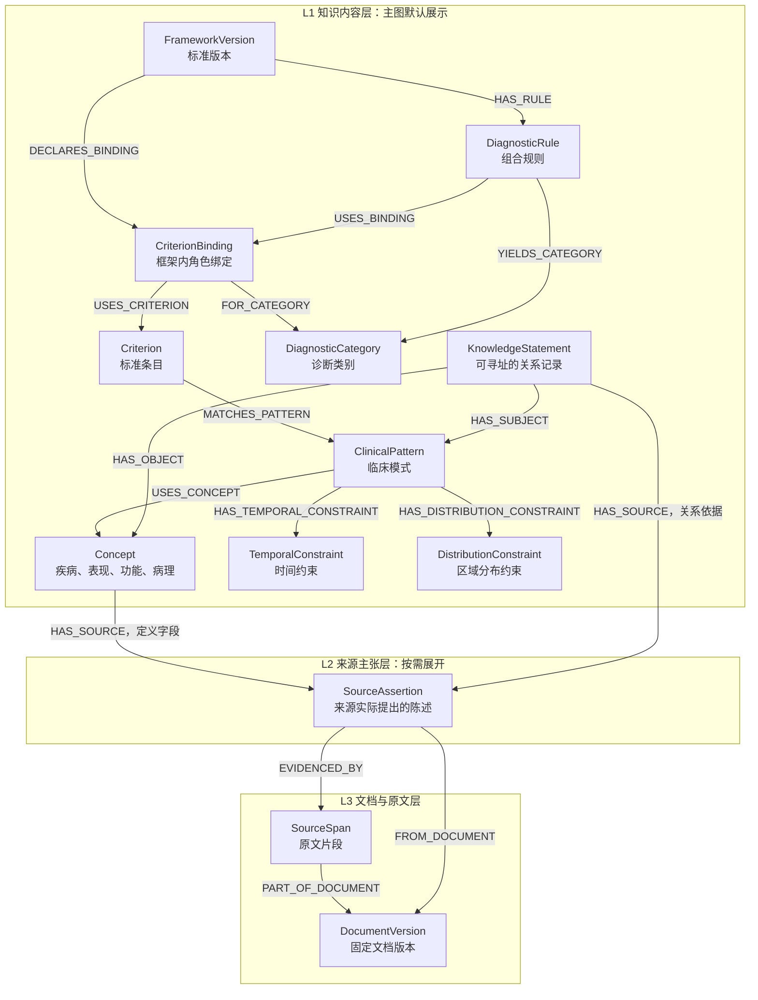

# NeuroGRA 知识与来源分层图谱结构设计

版本：0.3  
日期：2026-10-03  
状态：结构设计，尚未代表代码实现或临床验证完成。  
范围：领域知识、本体、来源主张与原文文档；病例观测、问答运行状态不属于本次核心图谱。

本版采用已经确认的思路：**先把知识内容组织成可读、可查询的节点和边，再通过独立的来源主张节点关联到文档与原文。** 主图默认只展示知识层，来源层按需展开。构建时仍同步保存来源映射，不在知识汇整时丢弃出处。

这是独立的新文档。[上一版设计](D:/PYTHON/NeuroGRA/NeuroGRA/docs/知识图谱设计/NeuroGRA_知识图谱与Ontology设计.md)保留；涉及本版节点、边和分层方式时，以本文的契约为准。医学内容依据继续使用[诊断入门综述](D:/PYTHON/NeuroGRA/NeuroGRA/docs/reviews/神经退行性疾病诊断入门综述.md)与[原始文献目录](D:/PYTHON/NeuroGRA/NeuroGRA/docs/references/neurodegenerative_diagnosis_20261003/README_文献目录.md)。

## 1. 总体结构和设计原则

### 1.1 三层分别回答什么问题

| 层 | 回答的问题 | 内容 |
|---|---|---|
| L1 知识内容层 | 知识是什么？哪些对象存在什么关系？ | 领域概念、临床模式、诊断框架、条目与角色、规则、类别、检测用途、分期、知识关系记录 |
| L2 来源主张层 | 哪个来源具体提出了这项知识？支持哪些字段？ | SourceAssertion；保留来源陈述、适用条件、否定与不确定性、抽取和审核状态 |
| L3 文档与原文层 | 来自哪个版本的哪篇文档、哪段文字？ | DocumentVersion、SourceSpan；支持回看原文与精确定位 |

层间基本路径：

```text
知识节点 ──HAS_SOURCE──> 来源主张 ──FROM_DOCUMENT──> 文档版本
                             └──EVIDENCED_BY──> 原文片段 ──PART_OF_DOCUMENT──> 文档版本

知识节点A ──医学关系──> 知识节点B
                 │ statement_ref（指向该边的知识关系记录）
                 ▼
          KnowledgeStatement ──HAS_SOURCE──> 来源主张 ──> 原文 / 文档
```

第二条路径解决“边怎样挂来源”：普通属性图中的边不能再充当另一条边的端点，因此为医学关系保留一个可寻址的 KnowledgeStatement 节点。主图仍显示 A→B 的直连边，来源展开时再显示它对应的关系记录。

### 1.2 必须保留的六项原则

1. 每个正式知识节点有可追溯的来源；来源必须支持它的具体定义或字段，不能只因为提到节点名称就作为定义依据。
2. 每条具有医学含义的正式关系有 KnowledgeStatement 记录和来源链，不能仅给关系两端的节点挂来源。
3. “来源主张”和“文档”不同：一篇文档包含多项主张，一项知识可关联多个来源主张和多个文档。
4. 时间、区域、方法、人群、阈值、诊断框架和例外属于知识内容，不能因为来源分层而从知识层移除。
5. 先形成知识主图是组织和展示顺序；出处映射必须随构建保存。未追溯的知识可暂存 draft，不进入正式发布。
6. 来源数不是独立研究数、证据等级或医学可信度。不同来源的限定或结论不同，不能直接合成无条件关系。

“每个节点挂来源”指 L1 的知识节点。L2 的来源主张通过原文和文档说明出处；L3 已是出处载体，无需再递归创建来源节点。发布清单、导入记录等工程元数据另存，避免无限溯源链。

### 1.3 分层结构图



图为核心关系的简图，不穷举检测和分期节点。图中 P→C 的直连边通过 statement_ref 指向 S；S 与该边表示同一项关系，不是两条独立医学证据。不同知识对象可以分别挂载不同 SourceAssertion，图中共享节点只用于示意多对多结构。

## 2. 节点类型总表

本版规定 **17 种核心节点类型：知识层 14 种，来源主张层 1 种，文档层 2 种**。疾病、表型等是 Concept 的医学子类型，不再分别计算为额外核心类型。

| 编号 | 层 | 节点类型 | 中文名称 | 保存的知识内容 |
|---|---|---|---|---|
| N01 | L1 | Concept | 医学概念 | 疾病、症候群、表型、功能、病理、解剖、标志物、基因与变异的身份和定义 |
| N02 | L1 | ClinicalPattern | 临床模式 | 一组表现怎样按时间、部位、功能和测量条件共同出现 |
| N03 | L1 | TemporalConstraint | 时间约束 | 起点、事件顺序、时间窗、持续时间、进展或波动的操作定义 |
| N04 | L1 | DistributionConstraint | 分布约束 | 受累区域、同一区域、不同区域、侧别和去重计数定义 |
| N05 | L1 | MeasurementDefinition | 测量定义 | 检查测什么、怎样测、样本和平台、结果类型、单位 |
| N06 | L1 | DiagnosticUse | 检测用途 | 某个具体测量在特定场景中用于分流、确认、鉴别或分期等 |
| N07 | L1 | FrameworkVersion | 诊断框架版本 | 某个病种的具体标准、年份、临床或研究用途和范围 |
| N08 | L1 | Criterion | 标准条目 | 标准中的一项定义及其子定义、模式和例外 |
| N09 | L1 | CriterionBinding | 条目角色绑定 | 某条目在某个框架和类别中是前提、核心、支持、警示还是排除项 |
| N10 | L1 | DiagnosticRule | 诊断组合规则 | 条目之间的 AND、OR、计数、门控、例外及目标类别 |
| N11 | L1 | DiagnosticCategory | 诊断类别 | 指定框架内定义的类别及其含义，区别于疾病身份和严重程度 |
| N12 | L1 | StageScheme | 分期方案 | 某一轴上的分期体系及适用范围 |
| N13 | L1 | StageDefinition | 阶段定义 | 某方案中的单个阶段及归属条件 |
| N14 | L1 | KnowledgeStatement | 知识关系记录 | 一项规范化的关系命题，为直连边提供稳定身份、限定和来源挂载点 |
| N15 | L2 | SourceAssertion | 来源主张 | 一个原始来源具体陈述的内容、条件和审核记录 |
| N16 | L3 | DocumentVersion | 文档版本 | 文献身份、内容版本、作者、年份、文件与校验和 |
| N17 | L3 | SourceSpan | 原文片段 | 一段未经改写的原文、所在页和解析版本 |

病例、Observation、AnswerClaim、RetrievalRun 等运行对象不计入上述 17 类。它们在独立任务或病例模块中引用本图谱，不能把某患者的结果存进模式定义。

## 3. 公共字段和字段状态

### 3.1 所有节点的公共字段

| 字段 | 类型 | 必填性 | 含义 |
|---|---|---|---|
| node_id | String | 必填 | 稳定逻辑身份，不由名称或术语版本直接决定 |
| revision_id | String | 必填 | 不可变修订；修改定义或限定时生成新修订 |
| node_type | Enum | 必填 | 上表 17 种之一 |
| label | String | 必填 | 人可读名称，不用于替代身份 |
| schema_version | String | 必填 | 序列化契约版本 |
| lifecycle_status | Enum | 必填 | active / deprecated；停用不同于审核拒绝 |
| review_status | Enum | 必填 | pending / approved / rejected |
| created_at | DateTime | 必填 | 带时区创建时间 |
| origin_record_id | String | 必填 | 导入、抽取、人工编辑或迁移过程记录 |

release_id 由发布成员表关联 revision_id；同一修订可进入多个 release，不用覆盖节点的单值字段丢失发布历史。图查询固定一个 release，所有端点和规则引用使用该发布选定的修订。

### 3.2 通用结构化字段

| 字段结构 | 保存什么 | 约束 |
|---|---|---|
| Scope | population、setting、method、method_version、specimen、comparator、target、time、framework_ref | 每项封装 status、value；status 为 known / unknown / not_reported / not_applicable |
| ConditionExpression | ATOM、ALL、ANY、NOT、AT_LEAST_K、COUNT_DISTINCT、TEXT 及其参数 | 原子字段的类型、单位与运算符由字典定义；TEXT 表示尚不可执行 |
| ObjectRef | node_id、revision_id、node_type | 正式发布必须可解析，不能引用不存在的修订 |
| EvidenceLocator | span_revision_id、start、end、quote | Unicode 字符半开区间 [start,end)；必须精确匹配原文 |
| ExternalMapping | namespace、external_id、external_version、mapping_relation、mapping_basis_ref | exact / close / broad / narrow / related；近似映射不触发节点合并 |

known 有值；unknown 表示未能判定；not_reported 表示核对来源后发现未报告；not_applicable 需要理由。缺失不是阴性、无条件或不适用。Scope 和条件树先作为结构化字段，不在本版额外建 Scope/Condition 节点。

## 4. 知识内容层节点的详细字段

以下均继承第 3.1 节。表中的引用字段与第 6 节对应边必须保持一致；它们是同一关系的序列化与图投影，不能各自独立修改。

### 4.1 N01 Concept：医学概念

| 字段 | 类型 | 内容与要求 |
|---|---|---|
| concept_kind | Enum | disease / syndrome / phenotype / functional_state / pathological_process / anatomical_region / biomarker / gene / genetic_variant |
| preferred_labels | Map[String,String] | 规范名称，可分别存中文和英文 |
| aliases | List[Object] | 别名、缩写、语言、别名类别；别名不是新概念 |
| definition | String | 概念的医学定义；正式节点必须有对应来源 |
| scope_note | String，可空 | 使用边界、易混淆对象和不允许的等价转换 |
| external_mappings | List[ExternalMapping] | 与外部词表的映射；候选与审核通过的映射分开 |
| variant_descriptor | Object，可空 | 仅遗传变异使用：位点/重复扩增等明确描述；不凭基因名生成具体变异 |

例：ALS 是 disease，认知波动是 phenotype，功能受损是 functional_state，某病理过程是 pathological_process。基因风险关联、致病变异和携带状态由有范围的知识关系分别表达，不在 Concept 上设置一个无条件“致病=true”。

### 4.2 N02 ClinicalPattern：临床模式

| 字段 | 类型 | 内容与要求 |
|---|---|---|
| pattern_kind | Enum | symptom_combination / functional / pathological / measurement_result / composite |
| definition | String | 整个模式的含义 |
| terms | List[Object] | term_id、concept_ref、expected_value、qualifiers、variable_bindings；可引用测量定义 |
| expression | ConditionExpression | 组成项之间的 AND/OR 等关系，term_id 唯一 |
| temporal_constraint_refs | List[ObjectRef] | 时间限定 |
| distribution_constraint_refs | List[ObjectRef] | 部位与计数限定 |
| measurement_refs | List[ObjectRef] | 结果模式依赖的测量方法 |
| scope | Scope | 模式适用范围，不能由同名模式继承其他标准的范围 |

模式定义不保存患者的检查值。某个模式“引用表型”也不等于表型必然存在；expected_value 和表达式保留阳性、阴性、组合及未知处理的语义。

### 4.3 N03 TemporalConstraint：时间约束

| 字段 | 类型 | 内容与要求 |
|---|---|---|
| anchor_definition | Object | 时间起点，如标准定义的疾病起病；不能默认用就诊时间 |
| target_event | Object | 被限定的事件及其操作定义 |
| temporal_relation | Enum | before / after / within / persists_for / progressive / fluctuating |
| window | Object，可空 | 下界、上界、单位、包含边界；没有明确数值时不得补造 |
| operational_definition | String | “进展”“波动”等怎样判定，保留来源定义 |
| uncertainty_policy | Enum | interval_three_valued；不确定起点跨越边界时返回 unknown |

例如 PSP 某条目的时间窗必须同其事件定义一起检索，不能只返回“3 年”而漏掉起点和其他条目要求。

### 4.4 N04 DistributionConstraint：区域分布约束

| 字段 | 类型 | 内容与要求 |
|---|---|---|
| region_scheme | Object | scheme_key、区域定义、membership_rules；如标准内的体部区域与肌肉判定要求 |
| region_refs | List[ObjectRef] | 引用 anatomical_region 概念 |
| variables | List[Object] | variable_name、value_type；例如 r:body_region |
| expression | ConditionExpression | SAME_REGION / DISTINCT_REGIONS / HAS_SIDE 等注册操作及组合 |
| counting_unit | Enum | region / muscle / distinct_feature；不同单位不混用 |
| deduplication_key | String或Object | 对哪个医学单位去重，不按文档或检查报告数量计数 |
| membership_definition | String | 什么证据足以称一个区域受累 |

ALS 的区域、肌肉、神经根和神经分布要求保存在上述定义中；仅列“颈段、胸段”等名称并不足以表达标准。

### 4.5 N05 MeasurementDefinition：测量定义

| 字段 | 类型 | 内容与要求 |
|---|---|---|
| measurement_kind | Enum | clinical_exam / laboratory / imaging / electrophysiology / scale / genetic_test |
| definition | String | 测量或检查的操作含义 |
| measured_concept_refs | List[ObjectRef] | 测量的标志物、病理、功能或表现 |
| method_descriptor | Object | 方法、技术和操作说明；未知字段明确标记 |
| specimen | Object，可空 | 样本类型及状态 |
| platform_version | Object | 平台与版本及状态 |
| result_schema | Object | value_type、单位、枚举范围、量表版本、缺失状态 |

定义检查和判断用途分开：同一检查可有多种用途，但不同平台版本不默认共享阈值。

### 4.6 N06 DiagnosticUse：检测用途

| 字段 | 类型 | 内容与要求 |
|---|---|---|
| measurement_ref | ObjectRef | 必须是 MeasurementDefinition |
| target_ref | ObjectRef | 本用途识别的疾病、病理、功能或指定类别 |
| use_type | Enum | triage / confirmation / differential / staging / prognosis / impairment_detection / pathology_detection |
| scope | Scope | 人群、场景、样本和方法范围 |
| qualification_expression | ConditionExpression | 来源规定的准入或性能条件 |
| threshold_definition | Object，可空 | 具体阈值、单位、方法版本、边界；来源未给出则不设通用默认值 |
| reference_standard | Object | 验证目标、采用的方法/标准引用、局限及字段状态 |
| framework_ref | ObjectRef，可空 | 来源明确绑定诊断框架时使用 |

reference_standard 是本版的嵌入结构，不额外增加节点；需要独立复用时再升级。敏感度/特异度属于来源报告或用途限定，不等同个体诊断概率。

### 4.7 N07 FrameworkVersion：诊断框架版本

| 字段 | 类型 | 内容与要求 |
|---|---|---|
| framework_key | String | 同一逻辑标准跨版本的身份 |
| version_label | String | 年份、版本或修订标识 |
| name | String | 正式标准名称 |
| disease_refs | 非空List[ObjectRef] | disease / syndrome 概念 |
| purpose | Enum | clinical / research；不确定则 draft |
| scope | Scope | 标准适用人群和场景 |
| category_refs | List[ObjectRef] | 该版本定义的类别 |
| binding_refs、rule_refs | List[ObjectRef] | 该版本的角色绑定和规则 |

临床标准与研究框架并存，不按发布时间自动覆盖。框架出处通过 HAS_SOURCE→SourceAssertion→DocumentVersion 保存，而不是只存一个无法定位的 source 字符串。

### 4.8 N08 Criterion：标准条目

| 字段 | 类型 | 内容与要求 |
|---|---|---|
| criterion_key | String | 稳定条目身份；修改含义产生修订或新身份 |
| source_item_code | String，可空 | 来源中的条目编号，如 P1；不能跨框架仅按编号合并 |
| operational_definition | String | 条目完整定义 |
| pattern_ref | ObjectRef | 被核对的 ClinicalPattern |
| subdefinition_refs | List[ObjectRef] | 依赖的时间、区域、模式、测量或其他条目 |
| exceptions | List[ConditionExpression] | 来源给出的例外 |
| structured_status | Enum | structured / partial / text_only |

Criterion 本身不设置永久 role；相同表现或条目在不同框架中的作用由 CriterionBinding 决定。定义不同的条目不强制共享节点。

### 4.9 N09 CriterionBinding：角色绑定

| 字段 | 类型 | 内容与要求 |
|---|---|---|
| framework_ref | ObjectRef | 一个固定 FrameworkVersion |
| category_ref | ObjectRef | 一个 DiagnosticCategory；框架通用条目按各类别显式绑定 |
| criterion_ref | ObjectRef | 一个 Criterion 修订 |
| role | Enum | prerequisite / core / supportive / red_flag / exclusion / indicative_biomarker / supportive_biomarker |
| group_key | String | 规则中计数和去重的医学条目身份，不是来源组 |
| applicability_expression | ConditionExpression | 条目何时适用，如检查已执行时才核对结果 |
| interpretation_note | String，可空 | 角色说明，不能替代完整规则 |

唯一约束至少包含 framework_ref、category_ref、criterion_ref、role 和适用条件。不同类别下的同一条目可以建立不同绑定。

### 4.10 N10 DiagnosticRule：组合规则

| 字段 | 类型 | 内容与要求 |
|---|---|---|
| framework_ref | ObjectRef | 固定框架版本 |
| output_category_ref | ObjectRef | 一个目标类别；必须属于同一框架 |
| expression | ConditionExpression | ALL / ANY / NOT / AT_LEAST_K / COUNT_DISTINCT / COMPARE_COUNTS 与 BINDING_REF / PATTERN_REF |
| binding_refs | List[ObjectRef] | 表达式实际使用的全部角色绑定 |
| dependency_refs | List[ObjectRef] | 完整求值或解释需要的条目、时间、区域、模式、测量等 |
| scope | Scope | 规则适用范围 |
| rule_completeness | Enum | complete / partial；缺少原文条目、定义或例外不能标 complete |
| executable | Boolean | 仅在结构完整、操作受支持、人工审核通过时为 true |
| evaluator_contract_version | String，可空 | 可执行时必填；文档设计并不表示求值器已实现 |

求值使用 true / false / unknown；未做检查不等于阴性。计数以 group_key 或明确变量去重，不按论文数计数。可选检查按来源门控，不默认要求所有人做所有检查。

### 4.11 N11 DiagnosticCategory：诊断类别

| 字段 | 类型 | 内容与要求 |
|---|---|---|
| framework_ref | ObjectRef | 类别归属的标准版本 |
| category_code | String | 框架内类别编码 |
| definition | String | 原标准定义的含义 |
| diagnostic_axis | Enum | clinical_diagnostic_category / research_classification / biological_classification |
| disease_ref | ObjectRef | 被分类的疾病或症候群概念 |
| rule_refs | List[ObjectRef] | 产生该类别的规则 |
| scope | Scope | 类别解释范围 |

例如 possible/probable 是某标准定义的类别，不编码成跨病种通用概率，更不作为统一严重程度阶梯。疾病本身与类别分为两个节点。

### 4.12 N12 StageScheme：分期方案

| 字段 | 类型 | 内容与要求 |
|---|---|---|
| scheme_key、version_label | String | 分期体系身份与版本 |
| axis | Enum | clinical_severity / functional / biological / pathological |
| framework_ref | ObjectRef | 归属或采用的框架版本 |
| disease_refs | List[ObjectRef] | 本方案作用于哪些疾病 |
| stage_refs | List[ObjectRef] | 阶段定义 |
| ordering_policy | Object | 是否有顺序、顺序含义、允许的相邻关系；不能默认所有方案线性 |
| scope | Scope | 方案范围 |

### 4.13 N13 StageDefinition：阶段定义

| 字段 | 类型 | 内容与要求 |
|---|---|---|
| scheme_ref | ObjectRef | 一个 StageScheme 修订 |
| stage_code | String | 方案内阶段编码 |
| definition | String | 阶段定义 |
| membership_expression | ConditionExpression | 满足该阶段需要什么 |
| dependency_refs | List[ObjectRef] | 功能、模式、测量、时间等定义 |
| display_order | Integer，可空 | 展示排序，不自动表示可推理的医学阶段关系 |

分期不替代病因判断；在 AD 等场景中，功能状态、临床阶段和生物学证据可分别记录、分别查询。

### 4.14 N14 KnowledgeStatement：知识关系记录

这是本版分层设计的关键对象。它属于知识层，表示已经规范化的关系命题；不是来源层中“某篇文档怎样说”的原始主张。

| 字段 | 类型 | 内容与要求 |
|---|---|---|
| subject_ref | ObjectRef | 本项关系起点；允许 N01–N13，不允许指向自己或来源节点 |
| predicate | Enum | 第 6 节注册的结构关系或医学谓词 |
| object_ref | ObjectRef | 本项关系终点；类型必须符合该谓词的端点约束 |
| normalized_text | String | 人可读的完整命题，不省略必要条件 |
| polarity | Enum | affirmed / negated / uncertain；相对于该规范化命题 |
| modality | Enum | required / recommended / permitted / prohibited / unspecified |
| scope | Scope | 本项关系的适用范围 |
| condition、exceptions | ConditionExpression；List | 关系的前提与例外 |
| semantic_qualifiers | Object | 该谓词定义的必要角色、条目、计数或比较维度 |
| source_alignment_status | Enum | aligned / partial / disputed；正式肯定投影须 aligned |
| normalization_record | Object | 输入来源主张引用、规范化方式、审核理由；不把多来源综合伪装成原文 |

一条来源主张可以支持多个节点字段或多个 KnowledgeStatement；多个来源主张也可以支持同一个 KnowledgeStatement，前提是它们确实支持相同的命题、范围和条件。

同一端点对可能有多个 KnowledgeStatement。去重键包含端点修订、谓词、polarity、modality、Scope、条件、例外和关键限定；不得仅按“节点 A＋节点 B”合并。

首期正式集合只发布有明确来源覆盖并审核通过的规范化命题。跨来源组合的新综合命题暂存 draft 并保留推导记录，不能仅把多条部分支持连起来就声称有文献完整支持。

## 5. 来源主张层与文档层节点字段

### 5.1 N15 SourceAssertion：来源主张

每个 SourceAssertion 归属一个原始文档版本。来源不同的陈述分别建节点，不把多篇文档先合成一个“来源”。文档是否全文都支持某项知识，要由对应原文和字段覆盖明确说明。

| 字段 | 类型 | 内容与要求 |
|---|---|---|
| document_ref | ObjectRef | 一个 DocumentVersion；必须同所有原文片段归属一致 |
| assertion_kind | Enum | definition / relation / criterion / rule / recommendation / comparison / research_result |
| source_statement_text | String | 忠实整理的来源陈述；可为释义，不冒充逐字引文 |
| source_predicate | String或Enum | 来源主张的原意或受控关系 |
| source_participants | List[Object] | 主体、客体、比较对象等角色，保留未规范化文字 |
| polarity、modality | Enum | 来源的肯定/否定/不确定性，以及必需/推荐等语气 |
| scope、condition、exceptions | 结构化字段 | 原文范围、前提与例外；缺失保持状态 |
| reported_results | List[Object] | 来源提供的数值、单位、区间类型、样本说明、目标和时点 |
| reported_evidence_grade | Object，可空 | 仅保存原文明确报告的证据等级或推荐强度 |
| extraction_method、extraction_run_id | Enum、String | manual / imported / model_extracted 及产生过程 |
| extraction_confidence | Decimal，可空 | 仅表示抽取评估，不是临床概率或证据强度 |
| field_evidence | Map[字段路径,List[EvidenceLocator]] | 关系、Scope、阈值、条件、否定等字段对应哪些精确原文 |
| review_record_ids | List[String] | 人工核对记录 |

quoted 原文放在 EVIDENCED_BY 边的 quote；source_statement_text 可为释义。两者职责不同，不用释义校验原文偏移。

### 5.2 N16 DocumentVersion：文档版本

| 字段 | 类型 | 内容与要求 |
|---|---|---|
| document_id | String | 逻辑文档身份；同一文档不同内容版本共享此身份 |
| title、authors | String、List[String] | 标题和作者 |
| publication_date | Date或状态封装 | 年份或实际日期，不补造未知月份和日期 |
| document_kind | Enum | guideline / consensus / article / review / reference_resource / terminology |
| source_role | Enum | medical_content / terminology / method_reference；算法方法资料不自动成为医学事实 |
| identifiers | Object | DOI、PMID、ISBN 等，按实际有无保存 |
| source_version、content_hash | String | 来源内容版本与文件/内容校验和 |
| snapshot_ref、source_url | String，可空 | 冻结文件位置或可追溯来源网址 |
| language | String | 文档语言 |
| source_family | Object | verified_study_id（可空）、report_role、dependency_status、identity_basis；研究身份不明时不强行合并 |

source_family 先作为文档字段，研究身份核实时保留依据。引用同一文档或 DOI 相同不自动证明两条主张一致；不同文档也不自动证明证据独立。

### 5.3 N17 SourceSpan：原文片段

| 字段 | 类型 | 内容与要求 |
|---|---|---|
| document_ref | ObjectRef | 固定 DocumentVersion |
| parse_id | String | 本次解析版本；解析变化不覆盖旧偏移 |
| original_text | String | 原始片段文本，检索清洗不能覆盖它 |
| section_path | List[String] | 标题和章节路径 |
| locators | Object | pdf_page_index（0 起）、printed_page_label、段落/表格/脚注编号、区域坐标等 |
| span_kind | Enum | paragraph / table_cell / table_note / heading / list_item |
| normalization_map | Object，可空 | 若用规范化文本抽取，需映射回 original_text |

引文偏移由 EVIDENCED_BY 保存，跨度以本 SourceSpan 的 original_text 为基准。PDF 页索引与印刷页码分别命名，避免把“PDF 第 3 页”误当论文印刷页码 3。

## 6. 边的类型、字段与端点

### 6.1 边的公共字段

| 字段 | 类型 | 必填性 | 内容 |
|---|---|---|---|
| edge_id、edge_revision_id | String | 必填 | 关系身份与冻结修订 |
| relation_type | Enum | 必填 | 本节注册关系之一 |
| source_ref、target_ref | ObjectRef | 必填 | 起点、终点及各自修订 |
| qualifiers | Object | 必填，可为空 | 必须符合该关系专用 schema，不接受任意未注册属性 |
| statement_ref | ObjectRef | 按关系类别 | 医学/定义关系直连投影必须指向 N14；纯表示与来源定位边不填 |
| origin_record_id、schema_version | String | 必填 | 构建依据和契约版本 |
| review_status | Enum | 必填 | 审核状态；正式关系 approved |

同一端点允许多条不同命题的平行边；唯一性包括 statement_ref 和必要 qualifiers。正式边的两个端点与 statement_ref 必须属于同一 release。每一条边的语义、起点和终点在下面的注册表中固定。

对于 A/B 组，边的完整医学内容还包括其 KnowledgeStatement 中的 polarity、modality、scope、condition、exceptions。关系详情必须读取这些字段，不能只显示关系名称。图投影可以缓存这些字段以便筛选，但缓存须由 statement_ref 对应修订生成并校验一致；不能在边上另写一个互相矛盾的条件或默认为无条件。C/D 组采用各自的定位、覆盖和依赖字段，不把临床概率作为通用边权重。

### 6.2 A 组：知识定义与组成关系

下表均为具有领域含义的关系，正式发布要求 statement_ref 与来源覆盖。基数描述单个起点在固定 release 下允许的关系数量，不代表已知对象必然拥有所有可选边。

| 编号 | 边类型 | 起点 → 终点 | 含义 | qualifiers 内容 / 基数 |
|---|---|---|---|---|
| A01 | IS_A | Concept → Concept | 概念子类属于上位概念 | hierarchy_scheme；0..n；无环，不能把相关关系当层级 |
| A02 | PART_OF | Concept → Concept | 解剖等概念的组成归属 | part_role；0..n；与 IS_A 不混用 |
| A03 | USES_CONCEPT | ClinicalPattern → Concept | 模式包含一个概念项 | term_id、expected_value、variable_bindings；1..n，可多条指向同一概念 |
| A04 | HAS_TEMPORAL_CONSTRAINT | ClinicalPattern → TemporalConstraint | 模式采用时间限定 | constraint_role；0..n |
| A05 | HAS_DISTRIBUTION_CONSTRAINT | ClinicalPattern → DistributionConstraint | 模式采用分布限定 | constraint_role；0..n |
| A06 | DEFINES_REGION | DistributionConstraint → Concept(anatomical_region) | 约束引用的区域定义 | region_key、membership_rule_path；0..n |
| A07 | USES_MEASUREMENT | ClinicalPattern → MeasurementDefinition | 模式依赖测量定义 | term_id、measurement_role；0..n |
| A08 | MEASURES | MeasurementDefinition → Concept | 检查实际测量的对象 | result_component、measurement_role；1..n |
| A09 | USES_METHOD | DiagnosticUse → MeasurementDefinition | 用途采用哪个测量 | 无额外限定；恰好 1 |
| A10 | TARGETS | DiagnosticUse → Concept或DiagnosticCategory | 用途的识别/判定目标 | target_role；恰好 1，与 target_ref 一致 |
| A11 | APPLIES_TO | FrameworkVersion → Concept(disease或syndrome) | 框架适用于哪个疾病身份 | scope_role；1..n |
| A12 | DEFINES_CATEGORY | FrameworkVersion → DiagnosticCategory | 框架定义类别 | category_code；1..n |
| A13 | DECLARES_BINDING | FrameworkVersion → CriterionBinding | 框架声明条目角色 | 可为空；0..n |
| A14 | USES_CRITERION | CriterionBinding → Criterion | 角色绑定引用条目 | 可为空；恰好 1 |
| A15 | FOR_CATEGORY | CriterionBinding → DiagnosticCategory | 该角色在哪个类别中有效 | 可为空；恰好 1 |
| A16 | MATCHES_PATTERN | Criterion → ClinicalPattern | 条目核对的模式 | match_role；恰好 1 |
| A17 | HAS_RULE | FrameworkVersion → DiagnosticRule | 框架采用规则 | rule_role；0..n |
| A18 | USES_BINDING | DiagnosticRule → CriterionBinding | 规则引用角色绑定 | expression_paths、group_key；0..n，须覆盖表达式所有绑定 |
| A19 | YIELDS_CATEGORY | DiagnosticRule → DiagnosticCategory | 完整规则对应的输出类别 | output_role；恰好 1；不是已对患者得出结论 |
| A20 | CLASSIFIES | DiagnosticCategory → Concept(disease或syndrome) | 类别描述哪个疾病身份 | 可为空；恰好 1 |
| A21 | USES_STAGE_SCHEME | FrameworkVersion → StageScheme | 框架采用分期方案 | axis；0..n |
| A22 | STAGES | StageScheme → Concept(disease或syndrome) | 方案为哪个疾病分期 | axis；1..n |
| A23 | HAS_STAGE | StageScheme → StageDefinition | 分期方案包含阶段 | stage_code、display_order；1..n |
| A24 | DEPENDS_ON | Criterion、DiagnosticRule、StageDefinition、DiagnosticUse → Concept、ClinicalPattern、TemporalConstraint、DistributionConstraint、MeasurementDefinition、Criterion或CriterionBinding | 解释/求值必须带回的定义或条件 | dependency_role、expression_path、required_for；0..n；不产生自依赖或求值环 |

A24 只声明明确依赖，不表示“医学上可能相关”。按 required_for 检索必要定义、例外和来源，形成规则的约束闭包；缺少依赖时报告缺口。DiagnosticUse 的框架关联可以通过 scope.framework_ref 引用，在本版不额外注册一条用途→框架边。

### 6.3 B 组：医学语义关系

这些关系通过 KnowledgeStatement 规范化后投影为直连边；不仅保存关系名，还保留 Scope、条件、polarity、modality 和来源。下表是本版初始医学谓词注册集，不意味着所有关系都要立刻填充。

| 编号 | 边类型 | 起点 → 终点 | 关系内容 | 必须保留的限定 |
|---|---|---|---|---|
| B01 | CAN_MANIFEST_AS | Concept(disease或syndrome) → Concept(phenotype或functional_state) | 某病或症候群可出现某表现 | 适用人群、病程、表型范围；不是诊断充分条件 |
| B02 | ASSOCIATED_WITH | Concept → Concept | 有来源明确表达的关联 | 关联类型、范围和来源报告；共现抽取不能直接发布为该医学关系 |
| B03 | SUPPORTS_DIAGNOSIS | ClinicalPattern或DiagnosticUse → DiagnosticCategory | 某模式或检测用途支持该框架类别 | 框架、条件、支持含义；不能替代规则 |
| B04 | WEAKENS_DIAGNOSIS | ClinicalPattern或DiagnosticUse → DiagnosticCategory | 某模式或用途使该类别较不支持 | 同上；不自动成为绝对排除 |
| B05 | INDICATES_PROCESS | ClinicalPattern或DiagnosticUse → Concept(pathological_process或functional_state) | 模式或用途指向目标过程/功能状态 | 方法、目标、性能和不确定性；不自动推导临床痴呆 |
| B06 | CAN_COEXIST_WITH | Concept(pathological_process) → Concept(pathological_process) | 两种病理过程可能共存 | 人群与证据范围；不推出每个患者都共存或各自贡献比例 |
| B07 | DISTINGUISHES_FROM | Concept(disease或syndrome) → Concept(disease或syndrome) | 来源提出的比较或鉴别关系 | comparison_axis、discriminating_pattern/use_ref、条件；不是图距离判定 |
| B08 | RISK_ASSOCIATION_WITH | Concept(gene或genetic_variant) → Concept(disease) | 风险关联 | 人群、效应类型、来源报告；不等价确定致病 |
| B09 | PATHOGENIC_FOR | Concept(genetic_variant) → Concept(disease) | 来源明确的致病解释 | 变异描述、判定条件、外显率等已报告信息；不预测个人发病时间 |

CAN_COEXIST_WITH、ASSOCIATED_WITH 可能具有对称含义，但只保存一个确定方向的命题和来源；反向展示为可重建导航视图，不重复计为证据。DISTINGUISHES_FROM 的比较角色按来源保留，不自动对称。

诊断标准中的“绝对排除”采用 CriterionBinding.role=exclusion 加完整规则表达，不能由 WEAKENS_DIAGNOSIS 升级。跨病理到临床表型的因果推导也不能仅靠上述关联路径完成。

### 6.4 C 组：关系记录的表示边

| 编号 | 边类型 | 起点 → 终点 | 内容 | qualifiers / 基数 |
|---|---|---|---|---|
| C01 | HAS_SUBJECT | KnowledgeStatement → N01–N13 任一知识节点 | 规范化命题起点 | 可为空；恰好 1，与 subject_ref 一致 |
| C02 | HAS_OBJECT | KnowledgeStatement → N01–N13 任一知识节点 | 规范化命题终点 | 可为空；恰好 1，与 object_ref 一致 |

C01/C02 仅表示 N14 的已存端点，是工程表示边，不再为它们创建 KnowledgeStatement，以免递归。N14.predicate 必须是 A/B 组之一，其端点仍须符合那个谓词的约束，不能因为 C01/C02 允许多种类型就绕过 domain/range。

主图直连边的 edge.statement_ref 必须能找到唯一 KnowledgeStatement 修订，并满足：

```text
direct_edge.source_ref == statement.subject_ref
direct_edge.target_ref == statement.object_ref
direct_edge.relation_type == statement.predicate
direct_edge.qualifiers 与 statement.semantic_qualifiers 一致
```

KnowledgeStatement 是医学边内容的权威记录；直连边是可重建查询投影。二者不算两条独立知识，不分别审核后允许产生不同含义。

### 6.5 D 组：来源挂载与原文定位边

| 编号 | 边类型 | 起点 → 终点 | 内容 | 专用字段 / 基数 |
|---|---|---|---|---|
| D01 | HAS_SOURCE | N01–N14 任一知识节点 → SourceAssertion | 本知识的哪些字段或关系由此来源陈述支撑 | target_field_paths、source_field_paths、alignment、coverage、rationale；正式节点至少 1 |
| D02 | FROM_DOCUMENT | SourceAssertion → DocumentVersion | 来源主张归属的原始文档版本 | 可为空；恰好 1 |
| D03 | EVIDENCED_BY | SourceAssertion → SourceSpan | 定位支撑该主张或字段的原文 | start、end、quote、assertion_field_paths、evidence_role；1..n |
| D04 | PART_OF_DOCUMENT | SourceSpan → DocumentVersion | 原文片段归属 | 可为空；恰好 1，须同对应主张文档一致 |
| D05 | DOCUMENT_RELATION | DocumentVersion → DocumentVersion | 引用、二次转述、同研究报告或新版本关系 | dependency_type、status、basis_locators、rationale；0..n |

D01 的字段约束：

- target_field_paths 指知识修订的 definition、role、scope.population、expression.children[0] 等明确路径。
- source_field_paths 指 SourceAssertion 对应陈述或条件字段。只有原文出现名称，不能标为支持 definition。
- alignment 为 supports / qualifies / opposes / mentions；mentions 仅作导航，不满足正式知识的来源覆盖要求。
- coverage 为 complete / partial，范围只针对声明的 target_field_paths，不针对整个节点。一个来源可以完整支持一个字段，却不能因此被解释为支持全部字段。
- rationale 记录限定对齐理由。与规范化命题直接矛盾的主张通常另建不同 polarity/条件的 KnowledgeStatement；opposes 连接供比较，不能冒充支持依据。

D03 的 evidence_role 为 statement / scope / condition / exception / definition / result。一个来源主张可以有多条边引用同一片段的不同区间，唯一键需要包括区间和字段路径，不能只按主张与片段 ID 合并。

D05 的 dependency_type 为 cites / secondary_report_of / same_study_as / supersedes；status 为 verified / candidate。引用或同研究关系必须有依据，未知时不创建一个共享 unknown 文档或研究节点。candidate 只供审核，不作为去重独立证据的确定依据。

### 6.6 本版边类型数量与新增规则

本版注册 **40 种关系类型**：A 组 24 种、B 组 9 种、C 组 2 种、D 组 5 种。医学/定义关系与来源定位关系采用不同的来源要求，但共同使用公共字段。

新增关系须声明中文含义、端点类型、基数、限定字段、来源覆盖要求、对称/传递规则和验证样例。不能新增一个通用 RELATED_TO 后把核心、排除、因果与共现全部混在其中。

## 7. 每个节点与每条边怎样挂来源

### 7.1 概念来源和关系来源不能互相替代

| 对象 | 需要来源支持的内容 | 示例挂载路径 |
|---|---|---|
| Concept | definition、scope_note、关键术语映射 | 认知波动 → 定义来源主张 → 原文 → 文档 |
| ClinicalPattern及约束 | 组成项、时间/区域定义、操作要求 | 区域模式 → 组合要求主张 → 标准条目与脚注 |
| CriterionBinding | 框架、类别、role、适用门控 | 角色绑定 → 来源中“核心特征”的条目陈述 |
| DiagnosticRule | 完整表达式、例外和依赖 | 规则 → 一项或多项标准主张 → 各原文位置；要求逐分支覆盖 |
| DiagnosticUse | 用途、方法、人群、阈值及参考标准 | 用途 → 指南推荐/性能陈述 → 原文 |
| StageScheme / StageDefinition | 分期轴、各阶段定义和顺序 | 分期对象 → 分期陈述 → 标准文档 |
| KnowledgeStatement | 端点、谓词、否定、范围、条件和例外 | 关系记录 → 关系陈述 → 原文 |

每个知识节点都挂来源，但不能要求一律只挂一个来源；它们与 SourceAssertion 是多对多关系。不同节点可以复用同一来源主张，同一节点也可以由多条主张分别支持不同字段。

### 7.2 多来源如何汇整

| 来源情况 | 知识层处理 | 来源层处理 |
|---|---|---|
| 表达同一含义、同一范围与条件 | 可共享同一 KnowledgeStatement | 各文档的 SourceAssertion 分别保留 |
| 表达同一概念定义但只是别名不同 | 可归一为同一 Concept | 保留定义/别名各自字段依据 |
| 人群、方法、框架或条件不同 | 保留不同命题或条件化对象 | 不丢弃差异，分别保存 Scope |
| 来源相反或不确定性不同 | 不形成无条件肯定的聚合关系 | 保留不同 polarity 的主张及比较理由 |
| 二次综述重复转述同一标准 | 可链接同一知识，但不增加独立研究数 | 保存 secondary_report_of 等已核实关系 |
| 多个部分定义由人工组装 | draft，记录合成过程与待核对缺口 | 每条来源仅支持其实际覆盖字段，不能假设全量支持 |

正式字段覆盖允许多个已审核来源共同覆盖，但必须检查定义一致、范围一致、每项前提与例外均被保留，并记录规范化理由。只有图上“连了几个来源”而没有覆盖核对，不足以发布完整规则。

### 7.3 知识来自多少文档怎样计算

给定固定知识修订，沿 **有效支持该知识的 HAS_SOURCE → FROM_DOCUMENT** 查询，统计 distinct document_id；同时可展示 distinct 文档修订数量。排除 mentions 和未审核的候选，不把同一文档的多个片段重复计数。

建议界面分别显示“支持来源主张数”“支持文档数”“文档版本数”“已核实独立研究数/未知”。文档数只说明出处覆盖，不能作为医学结论投票权重。

## 8. 完整结构样例：DLB 的核心特征角色

以下为结构示例，依据[DLB 2017 原始共识](D:/PYTHON/NeuroGRA/NeuroGRA/docs/references/neurodegenerative_diagnosis_20261003/07_DLB_2017_McKeith_Fourth_Consensus.pdf)。名称是释义，ID 为示例；未在本文伪造精确引文和偏移。发布时必须从本地固定文档的原文实际定位。

### 8.1 本样例有哪些节点

| 示例 ID | 节点类型 | 内容 |
|---|---|---|
| c_dlb | Concept | DLB 疾病身份 |
| c_fluctuation | Concept | 认知波动的表型定义 |
| p_fluctuation | ClinicalPattern | 按标准操作定义核对认知波动的模式 |
| f_dlb_2017 | FrameworkVersion | DLB 2017 标准 |
| k_fluctuation | Criterion | 标准中的认知波动条目 |
| b_core_probable | CriterionBinding | 在该框架 probable DLB 类别中的核心特征角色 |
| r_probable | DiagnosticRule | probable DLB 完整组合规则，含痴呆前提与适用要求 |
| g_probable | DiagnosticCategory | 该框架 probable DLB 类别 |
| s_pattern_term | KnowledgeStatement | p_fluctuation USES_CONCEPT c_fluctuation 的规范化关系 |
| s_binding_criterion | KnowledgeStatement | b_core_probable USES_CRITERION k_fluctuation 的规范化关系 |
| a_definition | SourceAssertion | 原标准对认知波动定义的陈述 |
| a_core_role | SourceAssertion | 原标准将该条目列为核心特征的陈述 |
| a_rule | SourceAssertion | 原标准对类别组合条件的陈述 |
| d_dlb_2017 | DocumentVersion | 固定版本的共识文档 |
| span_definition、span_rule | SourceSpan | 实际定义片段与诊断条目片段；正式偏移待原文定位 |

表中仅列两个关系记录，其余医学/定义直连边也须有自己的 KnowledgeStatement，这里省略同样结构的记录以方便阅读。draft 示例不能直接作为完整正式图导入。

### 8.2 主要边怎么连

| 起点 | 边 | 终点 | 保存的关键内容 |
|---|---|---|---|
| f_dlb_2017 | APPLIES_TO | c_dlb | 该框架的疾病范围 |
| f_dlb_2017 | DEFINES_CATEGORY | g_probable | 框架内类别编码与定义 |
| f_dlb_2017 | DECLARES_BINDING | b_core_probable | 所属框架 |
| b_core_probable | USES_CRITERION | k_fluctuation | 指定条目修订；statement_ref=s_binding_criterion |
| b_core_probable | FOR_CATEGORY | g_probable | 核心角色在哪个类别中有效 |
| k_fluctuation | MATCHES_PATTERN | p_fluctuation | 按模式核对，不把名称直接当存在 |
| p_fluctuation | USES_CONCEPT | c_fluctuation | term_id、expected_value；statement_ref=s_pattern_term |
| f_dlb_2017 | HAS_RULE | r_probable | 完整组合规则 |
| r_probable | USES_BINDING | b_core_probable | 表达式中引用路径、group_key |
| r_probable | YIELDS_CATEGORY | g_probable | 完整规则对应类别，未对任何患者执行 |
| c_fluctuation | HAS_SOURCE | a_definition | target_field_paths=[definition] |
| b_core_probable | HAS_SOURCE | a_core_role | target_field_paths=[role,framework_ref,category_ref] |
| s_binding_criterion | HAS_SOURCE | a_core_role | 只覆盖这项条目关联与角色语境 |
| r_probable | HAS_SOURCE | a_rule | 规则表达各分支及前提的来源覆盖 |
| a_definition | FROM_DOCUMENT | d_dlb_2017 | 一个原始文档版本 |
| a_core_role | FROM_DOCUMENT | d_dlb_2017 | 可以与定义主张来自同一文档 |
| a_rule | FROM_DOCUMENT | d_dlb_2017 | 不因多个主张重复计为多篇文档 |
| a_definition | EVIDENCED_BY | span_definition | 正式入库后填写准确 start/end/quote |
| a_core_role、a_rule | EVIDENCED_BY | span_rule | 各字段可对应不同区间 |
| span_definition、span_rule | PART_OF_DOCUMENT | d_dlb_2017 | 归属一致 |

此例说明：**概念定义的来源、角色的来源、类别规则的来源可以来自同一文档，但它们支持的是不同内容。** 给 c_fluctuation 挂一个文档，不能替代 b_core_probable.role 和 r_probable.expression 的证据。

### 8.3 如何保留其他病种的特殊结构

| 病种/问题 | 使用的节点 | 保存的关键限定 |
|---|---|---|
| ALS 受累分布 | ClinicalPattern、DistributionConstraint、Criterion、DiagnosticRule | 同区域变量、不同区域计数、区域与肌肉定义、进行性损害和鉴别排除 |
| PSP 时间窗 | TemporalConstraint、ClinicalPattern、CriterionBinding | 起病锚点、时间范围、事件完整定义；某条目不满足不等于全部 PSP 被排除 |
| PD 核心、支持、警示与排除 | FrameworkVersion、CriterionBinding、DiagnosticRule | 各角色与类别绑定、计数平衡、可选检查门控、临床/研究用途 |
| AD 多轴及检测用途 | Concept、MeasurementDefinition、DiagnosticUse、StageScheme | 病理、功能、临床阶段分别表达；方法、人群、分流/确认范围分别保存 |
| MSA 不同类别的检查要求 | CriterionBinding、DiagnosticRule、DiagnosticCategory | 检查要求随指定类别变化，不跨类别套用 |
| HD 遗传知识 | Concept(genetic_variant)、KnowledgeStatement、MeasurementDefinition | 致病解释与风险关联不同；携带状态不自动生成临床表现或发病时间 |

## 9. 字段与图投影的示例格式

以下 JSON 只示范边、关系记录和来源挂载的格式；所有 ID 为示例，必须在实际发布集合中补齐其他对象。完整规则、原文和条件不在这个片段中伪造。

```json
{
  "statement": {
    "node_id": "s_pattern_term",
    "revision_id": "s_pattern_term:r1",
    "node_type": "KnowledgeStatement",
    "label": "认知波动模式引用认知波动概念",
    "schema_version": "0.3",
    "lifecycle_status": "active",
    "review_status": "pending",
    "created_at": "2026-10-03T00:00:00+08:00",
    "origin_record_id": "example:design",
    "subject_ref": {"node_id": "p_fluctuation", "revision_id": "p_fluctuation:r1", "node_type": "ClinicalPattern"},
    "predicate": "USES_CONCEPT",
    "object_ref": {"node_id": "c_fluctuation", "revision_id": "c_fluctuation:r1", "node_type": "Concept"},
    "normalized_text": "该模式引用认知波动概念作为组成项，实际存在性另按模式定义核对。",
    "polarity": "affirmed",
    "modality": "unspecified",
    "scope": {"framework_ref": {"status": "known", "value": "f_dlb_2017:r1"}},
    "condition": null,
    "exceptions": [],
    "semantic_qualifiers": {"term_id": "t_fluctuation", "expected_value": true, "variable_bindings": {}},
    "source_alignment_status": "partial",
    "normalization_record": {"input_assertion_refs": ["a_definition:r1"], "method": "manual_example", "review_reason": "结构示意，尚未完成原文覆盖核对"}
  },
  "direct_edge": {
    "edge_id": "e_pattern_term",
    "edge_revision_id": "e_pattern_term:r1",
    "relation_type": "USES_CONCEPT",
    "source_ref": {"node_id": "p_fluctuation", "revision_id": "p_fluctuation:r1", "node_type": "ClinicalPattern"},
    "target_ref": {"node_id": "c_fluctuation", "revision_id": "c_fluctuation:r1", "node_type": "Concept"},
    "qualifiers": {"term_id": "t_fluctuation", "expected_value": true, "variable_bindings": {}},
    "statement_ref": {"node_id": "s_pattern_term", "revision_id": "s_pattern_term:r1", "node_type": "KnowledgeStatement"},
    "origin_record_id": "example:design",
    "schema_version": "0.3",
    "review_status": "pending"
  },
  "source_edge": {
    "edge_id": "e_statement_source",
    "edge_revision_id": "e_statement_source:r1",
    "relation_type": "HAS_SOURCE",
    "source_ref": {"node_id": "s_pattern_term", "revision_id": "s_pattern_term:r1", "node_type": "KnowledgeStatement"},
    "target_ref": {"node_id": "a_definition", "revision_id": "a_definition:r1", "node_type": "SourceAssertion"},
    "qualifiers": {
      "target_field_paths": ["subject_ref", "predicate", "object_ref", "semantic_qualifiers"],
      "source_field_paths": ["source_statement_text", "source_participants"],
      "alignment": "supports",
      "coverage": "partial",
      "rationale": "仅示范挂载方式，实际字段对应仍需人工核对原文"
    },
    "statement_ref": null,
    "origin_record_id": "example:design",
    "schema_version": "0.3",
    "review_status": "pending"
  }
}
```

未列出的 Scope 字段在实际契约中明确补为 unknown，不自动解释为不适用。完整对象不得只靠示例片段满足正式准入要求。使用 true 也仅表示定义中期待核对存在，不是某患者已有该表现。

## 10. 存储、构建和查询方式

### 10.1 权威记录与主图展示

| 部分 | 保存方式 | 职责 |
|---|---|---|
| 17 类节点及 KnowledgeStatement | 结构化权威记录，冻结修订 | 语义与来源对应的权威数据 |
| A/B 组直连边 | 可重建图投影；携带 statement_ref | 主图浏览与按类型遍历 |
| C/D 组边 | 结构化关联与图投影 | 关系端点表示、字段依据、原文定位 |
| Chunk / 向量索引 | 独立检索工件 | 帮助找到原文；不充当来源身份或医学事实 |
| release 成员与审核记录 | 独立工程记录 | 可重复发布与历史追踪 |

建议继续使用 SQLite 保存权威对象与修订、Neo4j 保存图投影、原文文件保存冻结文档，兼容现有总体架构。复杂 ConditionExpression 先保存为经校验的 JSON；不能只存不可恢复的说明文本。

浏览模式：默认显示 L1 的 N01–N13 和直连关系；N14 收折在“关系详情”中。展开节点显示其 HAS_SOURCE；展开边通过 statement_ref 找 N14 再显示 HAS_SOURCE。L2/L3 不默认铺满主图，但来源可以完整查询。

### 10.2 构建步骤

1. 冻结文档内容，解析 SourceSpan，保留精确原文和定位。
2. 记录各来源自己的 SourceAssertion，核对前提、例外、语气和范围。
3. 汇整 Concept、模式、条目、框架、规则、用途与分期；在此阶段就挂载字段来源。
4. 将明确支持同一命题的来源归入 KnowledgeStatement；条件不同或相反的陈述分别保存。
5. 由 KnowledgeStatement 生成 A/B 组直连边；C/D 组保存表示和来源链。
6. 校验端点类型、字段覆盖、规则依赖、原文偏移和版本一致性，完成审核后固定 release。

步骤 1–2 是保存来源的构建底座，步骤 3–5 决定知识层如何组织。它不改变“知识和来源分层”的展示方式，也不需要用户先阅读来源才能理解知识主图。

### 10.3 查询路径

| 任务 | 路径 | 输出 |
|---|---|---|
| 看一个概念 | Concept及其 A/B 组邻接关系 | 定义、相关模式与关系；默认折叠来源 |
| 看一个节点出处 | 知识节点→HAS_SOURCE→SourceAssertion→文档/原文 | 支持哪些字段、来自哪篇文档、哪段原文 |
| 看一条关系出处 | 直连边.statement_ref→KnowledgeStatement→HAS_SOURCE→来源 | 关系的限定、规范化理由和原文支持 |
| 看诊断标准怎样组合 | FrameworkVersion→类别/角色/规则→条目→模式→约束 | 框架内完整定义、前提和例外 |
| 检查规则信息是否完整 | 根规则→DEPENDS_ON及全部表达式引用→来源覆盖 | 必需依赖和证据；缺失时输出 gap，不肯定回答 |
| 比较多个来源 | 同一知识的多项 SourceAssertion及各自 Scope | 相同、互补、范围不同或相反；不直接按篇数投票 |

患者实际资料进入独立病例模块后才能进行规则匹配。知识图谱中存在 YIELDS_CATEGORY 边，只说明标准定义的输出，不表示系统已经对患者完成诊断。

## 11. Ontology 约束与发布要求

### 11.1 类型和关系约束

- 17 类节点身份清晰；Concept 子类型受控，定义不同的 disease、syndrome、phenotype 不因名称相近而合并。
- A/B/C/D 各边只能连接注册表允许的端点；角色绑定与输出类别必须属于同一框架版本。
- CriterionBinding.role 不写在 Concept 上，来源数不写成疾病概率。
- 时间锚点、区域变量、检测方法和单位由明确契约约束；计数不受重复报告影响。
- 不从 IS_A 以外的关系随意做传递；医学支持、关联、共存和因果不能互相替换。
- clinical_severity、functional、biological、pathological 分轴，诊断类别与分期分开。
- unknown 不当 false；缺少知识也不等于疾病不存在；任意图路径不自动成为医学推理依据。

Ontology 首期体现为类型注册表、谓词端点表、字段字典、条件语法和校验约束。来源分层不要求先实现完整 OWL 推理系统；需要 RDF 导出时再映射，不把图数据库连通性当成本体推理。

### 11.2 每次正式发布必须通过的检查

| 检查 | 通过标准 |
|---|---|
| 节点来源 | 每个正式 L1 节点至少一条 approved HAS_SOURCE；关键医学字段的有效 supports/qualifies 依据完整 |
| 边来源 | 每条正式 A/B 边存在 approved、aligned KnowledgeStatement，且其关键字段来源覆盖完整 |
| 正反命题 | negated/uncertain 不投影成没有状态标识的肯定关系；展示保留 polarity/modality/条件 |
| 端点一致 | 直连边、N14 与其 HAS_SUBJECT/HAS_OBJECT 引用相同端点修订和谓词 |
| 来源定位 | SourceAssertion 恰好一个原始文档；所有 EVIDENCED_BY 片段属于这个文档 |
| 原文精确性 | original_text[start:end] 与 quote 一致，区间和页索引有效 |
| 字段覆盖 | 主张只是提及名称时不作为定义依据；部分覆盖不冒充完整规则支持 |
| 框架一致 | 一个规则及其绑定、类别不混拼不同标准版本 |
| 依赖完整 | 表达式引用都存在；所需定义、门控和例外可追踪；有缺口不能标 executable |
| 版本重现 | 节点、边、原文解析、条件契约与发布成员冻结；更新文档不改变旧 release |
| 去重与来源计数 | 不按片段数、来源主张数重复计文档；独立研究身份无依据时显示未知 |

临床准确性不由结构校验自动保证。正式来源覆盖指“有可追溯、解释核对过的依据”，不意味着全部相关医学知识已覆盖。

## 12. 与上一版及现有代码的对应

| 上一版/现有对象 | 本版落点 | 变化 |
|---|---|---|
| Entity / Concept | Concept | 统一知识层概念，补稳定身份、定义和子类型 |
| ClinicalPattern、TemporalPattern、DistributionPattern | ClinicalPattern、TemporalConstraint、DistributionConstraint | 时间/分布作为知识约束，保持具体病种语义 |
| LiteratureAssertion / ClauseRevision | SourceAssertion及KnowledgeStatement | 来源原意留在 L2，审核规范化的关系命题进入 L1；不能机械一分为二 |
| 文献主张参与者和关系 | KnowledgeStatement与 A/B 投影 | 边可寻址、可单独挂来源；保留语义限定 |
| 诊断标准和规则 | FrameworkVersion、Criterion、CriterionBinding、DiagnosticRule、DiagnosticCategory | 延续框架角色和组合结构 |
| MeasurementDefinition、DiagnosticUse、分期对象 | 本版对应节点 | 保留多轴与方法用途；ReferenceStandard先嵌入用途字段 |
| Document、SourceSpan、EvidenceRef | DocumentVersion、SourceSpan、EVIDENCED_BY | 文档层独立；精确引文作为定位边字段 |
| 旧主图来源展示 | L1 主图、L2/L3 展开 | 知识视图与来源视图分开 |
| Study、Chunk、Trace、病例评估 | 工程/扩展模块 | 本版 17 类核心类型不包含；需要时单独设计，不隐含已删除原有记录 |

现有代码不能自动支持本文新增结构。本次只交付新的数据模型；迁移时保留旧 ID 映射、来源和审核记录，先实现小规模完整例子，再批量扩展。

实施优先级：先落地 Concept、KnowledgeStatement、SourceAssertion、DocumentVersion、SourceSpan 的知识与来源分层；随后增加模式、角色和规则；检测用途及分期按病种需求进入。阶段性子集不改变完整 17 类契约，未实现的类型明确标记。

## 13. 汇报时可用的结构说明

本图谱分为三层。第一层将神经退行性疾病知识整理成概念、临床模式、诊断条目、组合规则和类别，并保留时间、部位、检测用途及标准版本。第二层记录每项知识的具体来源陈述，分别支持节点定义和医学关系。第三层保存来源文档及精确原文。

主图先回答“知识是什么、怎样连接”，展开来源后回答“哪个字段或关系由谁提出、来自哪篇文档哪段文字”。医学边通过 KnowledgeStatement 获得独立身份，因此不只能够追溯节点，也能追溯关系和规则。

相对于丢失这些限定的扁平实体关联图，该结构能保留解释神经退行性疾病诊断所需的信息。是否在检索效果上优于保留同样信息的文本或增强图方法，继续按上一版的公平对照方案验证，不因分层设计就预先宣布优势。
