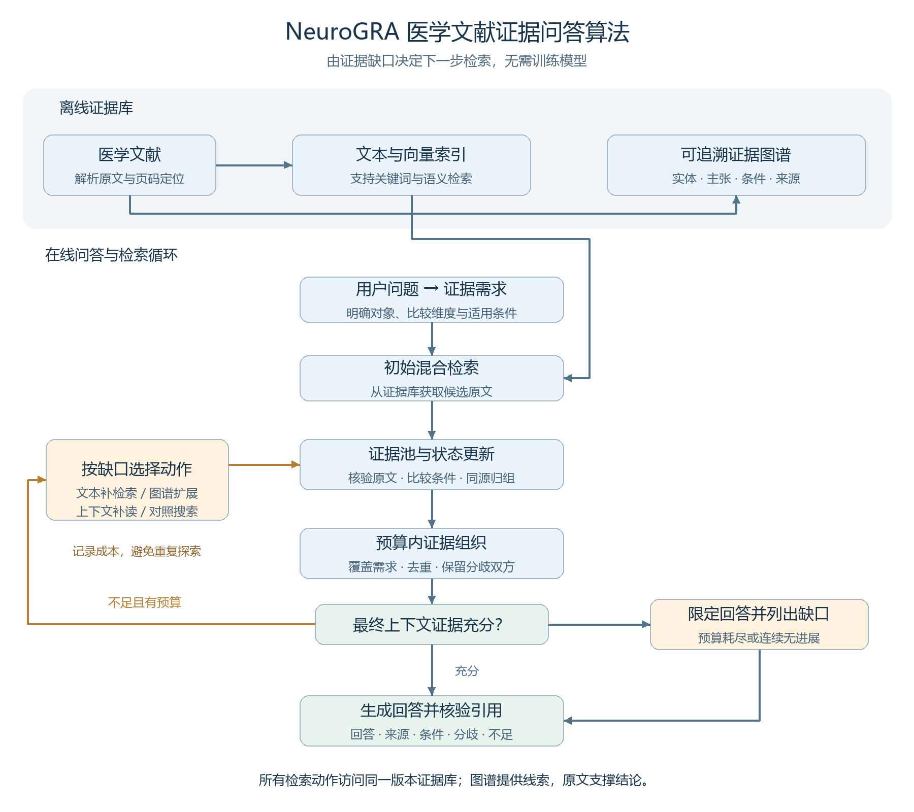

# NeuroGRA：医学文献证据问答算法

## 1. 算法要解决什么问题

医学文献问答需要找到足以支持回答的证据。仅检索“内容相似”的段落，容易遗漏比较对象、适用人群、研究方法或限制条件，也可能把同一研究的重复报道当成多份独立证据。

本算法先明确**回答问题需要哪些证据**，再根据尚未满足的需求决定下一步搜索。整个过程使用现成大语言模型和检索模型，无需训练或微调。

## 2. 算法架构

**图谱用于连接和寻找证据，原文用于支撑回答。** 图上的关联路径不能直接视为医学结论。

## 3. 核心算法如何运行

### 第一步：把问题变成证据需求

例如，问题是“不同文献对方法 X 在人群 P 中的结果是否一致？”系统将其拆成：各文献的结果、研究人群与方法、结果是否可比、可能的分歧及限制。每项需求分别记录为缺失、部分满足、已覆盖、存在分歧或条件未知。

### 第二步：根据缺口自适应检索

| 当前缺口 | 下一步动作 |
|---|---|
| 没找到相关结果或另一比较对象 | 用具体需求进行文本检索 |
| 已找到关键实体，缺少关联证据 | 沿指定关系扩展图谱，并回到原文 |
| 结果存在，但人群、方法或否定条件不清 | 补读上下文、表头或章节说明 |
| 需要判断不同来源是否一致 | 搜索对照、限制或相反证据 |

大语言模型负责理解问题和提取证据字段；程序负责工具权限、图关系约束、去重和预算控制。没有新增有效信息时停止重复探索。

### 第三步：组织足以回答的证据集合

证据按“主张＋适用条件＋原文＋来源”组成完整证据包。选择时优先考虑**单位文本成本能补齐多少证据需求**，并满足三项约束：

- **条件可比**：人群或方法不同的结果应分别解释；必要条件未知时，不能直接判定一致或冲突。
- **来源去重**：同一研究的重复报道不增加独立证据数量。
- **分歧保留**：发现可比条件下的相反结论时，保留双方依据，不只选支持某一答案的材料。

每轮选择后，按真正装入回答上下文的证据重新计算覆盖。找到很多段落，不等于问题已经被完整回答。

### 第四步：决定何时停止并生成回答

必要需求和条件均满足时停止检索；预算耗尽或连续无进展时，输出有依据的部分并说明缺口。回答中的实质性结论需要对应原文引用，分歧和适用范围一并呈现。

## 4. 算法重点与验证方式

拟研究的重点是：**将证据需求、条件可比性和来源依赖共同用于搜索决策与证据选择。** 自适应检索本身已有相关研究，本方案的增量需要实验验证。

实验将与普通混合检索、无图的需求驱动检索、固定图扩展和路径检索比较。在相同文献、模型及预算下，评价必要证据覆盖率、引用正确性、条件与分歧判断错误，以及调用成本。通过分别移除图导航、条件判断和来源去重，检查每个机制是否真正有效。

**一句话概括：先判断回答还缺什么，再有针对性地沿文本和图谱找证据，最后组织成条件清楚、来源可查的回答。**
